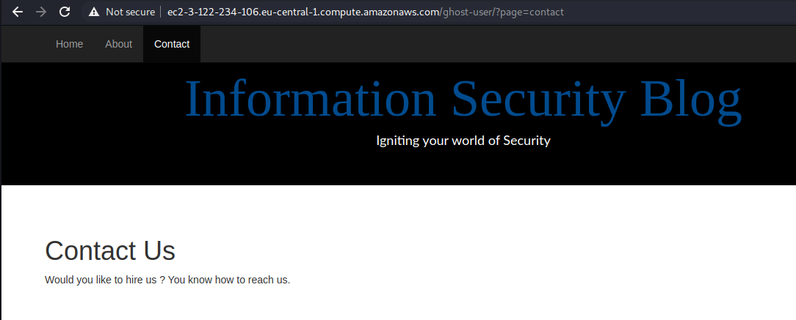

+++
title = "Cyber Talents Mini CTF Week 1"
date = 2021-02-08T22:44:24+11:00
lastmod = 2021-02-08T22:44:24+11:00
tags = ['CyberTalents', 'Mini CTF']
categories = ['CTF']
imgs = []
cover = ""  # image show on top
readingTime = true  # show reading time after article date
toc = true
comments = true
justify = false  # text-align: justify;
single = true  # display as a single page, hide navigation on bottom, like as about page.
license = ""  # CC License
draft = false
+++


# Info

This was the first one of the Cyber Talents February weekly mini CTFs. [Link here](https://cybertalents.com/competitions/mini-ctf-week-1)

There were 5 challenges:


# Event Manager


> Software products and services combine security information management and security event management. They provide real-time analysis of security alerts generated by applications and network hardware.

So the answer to this question was simply "SIEM".

Funny that I only got this flag at the last because it wasn't in a `flag{xxxx}` format and the question itself didn't look like something to solve LOL.

# Jett


> Ready to use your ultimate skills?

The file in the link can be found [here](jetty.s)

## Overview

Having a glance of the code, we can see that the program is basically asking a user input, and check the user input against a piece of encrypted data, character by character.

We can see that this part is saving the encrypted text into memory:

```asm
        mov     DWORD PTR [rbp-160], 150
        mov     DWORD PTR [rbp-156], 204
        mov     DWORD PTR [rbp-152], 233
        mov     DWORD PTR [rbp-148], 31
        mov     DWORD PTR [rbp-144], 211
        mov     DWORD PTR [rbp-140], 75
        mov     DWORD PTR [rbp-136], 212
        mov     DWORD PTR [rbp-132], 74
        mov     DWORD PTR [rbp-128], 193
        mov     DWORD PTR [rbp-124], 215
        mov     DWORD PTR [rbp-120], 85
        mov     DWORD PTR [rbp-116], 176
        mov     DWORD PTR [rbp-112], 132
        mov     DWORD PTR [rbp-108], 215
        mov     DWORD PTR [rbp-104], 57
        mov     DWORD PTR [rbp-100], 222
        mov     DWORD PTR [rbp-96], 38
        mov     DWORD PTR [rbp-92], 75
        mov     DWORD PTR [rbp-88], 2
        mov     DWORD PTR [rbp-84], 139
        mov     DWORD PTR [rbp-80], 75
        mov     DWORD PTR [rbp-76], 21
        mov     DWORD PTR [rbp-72], 215
        mov     DWORD PTR [rbp-68], 21
        mov     DWORD PTR [rbp-64], 229
```

And the rest part of the code is prompting user input and check user input against the encrypted text in memory with a loop.

Within the loop, the most important part is the following:

```asm
        movzx   eax, BYTE PTR [rbp-48+rax]
        movsx   eax, al
        imul    eax, eax, 137
        cdq
        shr     edx, 24
        add     eax, edx
        movzx   eax, al
        sub     eax, edx
        mov     DWORD PTR [rbp-8], eax
```

This part is where the encryption is applied to a user input character (before it's compared with the encrypted data in memory).

## Encryption

Firstly, the program multiplies the character by 137 and save the result into `eax`(`imul eax, eax, 137`).

The use of the `cdq` command here confused me for a while. After digging the internet for a while, I discovered that the `cdq` instruction will populate `edx` register with either 0x00000000 or 0xFFFFFFFF according to the sign bit of `eax`.

[Here's a explanation](https://www.aldeid.com/wiki/X86-assembly/Instructions/cdq) on how `cdq` works which helped me while I was solving this challenge.

So after `cdq` instruction, the value of `edx` would be either 0xFFFFFFFF or 0x00000000.

In case of `edx` is 0xFFFFFFFF, the following `shr edx, 24` instruction will make it 0x000000FF. Since it's only the lowest 8 bits of `eax` that we care about (because `movzx eax, al` is gonna truncate it, more on this later), `add eax, edx` is equivalent to minus 1 from `al`, and `sub eax, edx` is equivalent to adding 1 to `al`. Thus those 5 instructions is nothing but truncate `eax` to the lowest byte.

While in case of `edx` is 0x00000000, it's just adding 0, substracting 0 and truncating, which make it the same thing as in the former case. 

Actually, in case of this challenge, the result of `cdq` command should always be `edx = 0x00000000` if your input are all ASCII characters (bytes with values less than 127, i.e. sign bit is 0).

The following illustrates the process of a character being encrypted, assuming the character is `{` (0x7B):

```asm
        movzx   eax, BYTE PTR [rbp-48+rax] ; eax = 0x0000007B '{'
        movsx   eax, al                    ; eax = 0x0000007B '{'
        imul    eax, eax, 137              ; eax = 0x000041D3
        cdq                                ; edx = 0x00000000
        shr     edx, 24                    ; edx = 0x00000000
        add     eax, edx                   ; eax = 0x000041D3, adding 0, eax remains unchanged
        movzx   eax, al                    ; eax = 0x000000D3, TRUNCATED to the lowest 8 bits
        sub     eax, edx                   ; eax = 0x000000D3, substracting 0, eax remains unchanged
        mov     DWORD PTR [rbp-8], eax     ; saving eax to a variable for later comparison
```


## Solution

With the observation above we can conclude that this "encryption" is equivalent to simply **multiplying the character by 137 and truncate in into 1 byte**.

Knowing this, we can map ASCII values to the values when they are encrypted. By reverse-applying this mapping to the cipher text we can decrypt the message.

The solution Python script:

```python
# The encrypted message
c = [150, 204, 233, 31, 211, 75, 212, 74, 193, 215, 85, 176, 132, 215, 57, 222, 38, 75, 2, 139, 75, 21, 215, 21, 229] 

# The cipher/encryption look up table
cipher = [(i*137) & 0xff for i in range(128)] # [0, 137, 18, 155, 36, 173, 54, ..., 229, 110, 247]

# Decrypt
m = ''.join([chr(cipher.index(i)) for i in c])

print(m)
```

# Keep_it_real


> Someone was attacking me he wants the flag, can you get it for me plzz?

The file in the link can be fonud [here](Security.evtx)

This attached file is a Windows Events Log file. This was my first time even reading a Windows Event Log. I had no idea on what I should focus. So I just tried to sweep them through and try to spot special or unusual events.

There are events like commands being run, user login attempts, firewall rule configurations, user authentication, etc.

At near the end of the whole log, I found a suspicious command log involving a Powershell command:


```powershell
powershell -encodedcommand SQBuAHYAbwBrAGUALQBXAGUAYgBSAGUAcQB1AGUAcwB0ACAALQBVAHIAaQAgAGgAdAB0AHAAcwA6AC8ALwBkAG8AYwBzAC4AZwBvAG8AZwBsAGUALgBjAG8AbQAvAGQAbwBjAHUAbQBlAG4AdAAvAGQALwAxADEASABTAHoAVAB5ADQAcgByAEsAdwBwAHkAVQBwAE8ANgBWAHQAQgBVAFUARwB1ADkAVQA1AEcALQBHAHoATQBFADIATABrAC0ARgBwAFcAbwBCAFkALwBlAGQAaQB0AA==
```

Apparently someone's invoking a Base64 encoded command in Powershell. Decoding the command I saw:

```powershell
Invoke-WebRequest -Uri https://docs.google.com/document/d/11HSzTy4rrKwpyUpO6VtBUUGu9U5G-GzME2Lk-FpWoBY/edit
```

A URL is revealed! So I undoubtedly followed this URL and I saw a document on Google Docs:


And there's the flag.

# F4c70r5


> Factorize all the way down.

The file in the link can be found [here](F4c70r5_Challenge.rar)

Within the are 2 files: output.txt and chall.py.

chall.py

```python
from Crypto.Util.number import *
import gmpy2
from flag import secret
p=getPrime(4096)
tmp=p+1
while True:
	if gmpy2.is_prime(tmp):
		q=tmp
		break
	tmp+=1

n=p*q
e=65537
print('n =', n)
print('e =',e)
enc = pow(bytes_to_long(secret.encode('utf-8')), e, n)
print('c =', enc)
```

output.py

```
n = 951752236915140832199748908693039643482784483902074328805152520574468385894787697421628889837312458972368822789183098930476868578994142902453764619470382186354755124562803268913310858946286402116516483754756602529140275651078834300546643264985329750684825417442514923821552633128625753457645015075044061956724052192812576201789794767301565010564202298988374151879060406294779207920467185412840082028372405791915383934456951737197975581056577455791036472946853658594411665332114506312107092278569171428558469601903172523050878720198012321065470355433469102888390983859620558787782721021089046454177636243251008530778652539935319177019860166186598073853688108173567866856964231247743467203884294661799001344528347401880203635793885635687603373996944778461477934238349308758143858756378007109795423094162767268604861217986574048575615695036605182467246663712698158708360994071228569740025875000061607591055998995791318294626029902423257925493557973396873086155141354215324268519945474274624518403980430243297107310646831850667409915421977427982814772841812364106728134725959018907476291114992862954747327639913039819011123510523468215933213307149052291041234690528992120953812506086775432947875150929032507470872383342321761152185862410954914695269256060010182103092293436220392161939322643220150850208969833274937053068973036583300776912495875448942037637954685467830888130579233843151020956996407127776535323875659902175256183919651900586231557101839033051692618183938054400883059654179603789649279342156436311107337135650837932570003864094755382785765132441275390932663926677067406875136312313026192349567835315882590179528261212886474357396988032402033951840198822593311717170345608440901322529031100463858003133206628129764268267186114478751138267868108177825787340514421124393463100710365602111990713166880105539662820515965997510336916057089919924127382268740016570933153882739481179823220194457498711735966237458544092166854492151855733680113669882834970917588467468450763773336882979228362194182442258322316805501041863297777969310334720546258597111615461312729100390612277069296070632654079517272872979055722183223194776869479328497670120352467722367536755524499589657444808423490113499222992115969009472046264319634133903375127278919109319803759184078586322967338305943072778915505052846361177654906506357532514407981608861738428484545619373078305491281976784140033166189850676357295084311575339612481840333505348160169849713312838754559337662281366047808411
e = 65537
c = 327077386348346101184096522158226652435706099109225871900230605984351117903800246594337858410998149918232043480026957704607340241003909393490401385485967743182982413825006847930414171836365770142856359887366316596069720587979267537855809519478307478497476670378851336046128690581039298872182315778241635987972130791221393116202794711834897336580404069432555731332417554769920971759422836093644474913072748419219775921177794703183463315887088800152508124613335592138959844405427877616162481782552685977904222219470836883362427047811047129537868670830271572458177982888737218480600629620866088954699453114643847442370426675902077649948684148966904979971879186350657529867576919878719798381783529320030879788710833303137705581868186648545623094120792531304439317096445770907381060231469831880099129024887979180049500212268418241730570329522546476427136143317324249361548308164803903878761206743509441852708440542456223079124860276831333647047599740892333186355672896520911048217823236552892724847829949668610259009435097223596719104078489761546715092840149323895747624504395584601579144904792920541825749864659143193662609460918063314733238927359300548944228296908818325053348886598442688500795391716150621274601216681553976683866131173458417009219427716408782474282016150081936949011159232183305456506255260128017517283847723434446687211648945191738498243855399126444288977984419400412388096293382856052759009813224850897743317819017365421420567063206322176282003030630564379588629232090789463210087919793870744942378934994203557879067720951637556039454580251080480853408218836150626461790953446312776137924265253529859339253679904558759148971395984135661351771162122128182000249840629158929879588788517248104174638728121624277244803476490932860470492654810980915069811506536290083966326945180552995137541908382419642851304697704419620393233170013467112815287659902036962453676681004661436019063891097253794023633083935593859211244178961282904838164034035503609018017085207813372743755106523870407300139090930471246246452348347608751309929620939053506778225492876252594499312034372725757786558330299216112395531067775533238799121023265242763734573994957531160562422049356773668682449519855511601566261028308457741280980377600910658293342522613412979271358590917850339008659636307394967716472776596347614221668364785104488251632443992650239493772549442105328396648365818985242371694074768517093063734552089273679040641390304309114286021181293539442153357310326761928632
```

I noticed that `p` and `q` are 2 adjacent prime numbers based on the code in `chall.py`. This means if I calculate the square root of `n`, it should be in between of `p` and `q` and shouldn't be far from either of them.

My solution Python script:

```python
n = 95175223691...
e = 65537
c = 32707738634...

import gmpy2
from math import ceil

gmpy2.get_context().precision = 4096
x = int(gmpy2.sqrt(n))

tmp = x
while True:
	if gmpy2.is_prime(tmp):
		q = tmp
		break
	tmp += 1

print('q: ', q)

tmp = x
while True:
	if gmpy2.is_prime(tmp):
		p = tmp
		break
	tmp -= 1

print('p: ', p)

def egcd(a, b):
	x,y, u,v = 0,1, 1,0
	while a != 0:
		q, r = b//a, b%a
		m, n = x-u*q, y-v*q
		b,a, x,y, u,v = a,r, u,v, m,n
		gcd = b
	return gcd, x, y

phi = (p - 1) * (q - 1)
_, d, __ = egcd(e,phi)

m = pow(c,d,n)
print(m.to_bytes(ceil(m.bit_length()), 'big').decode())
```

# gh0st Us3r


> We are creating InfoSec blog to upload our recent work. If you faced any issues don't hesitate to infor us.

Following the link, we are greeted by a welcome page.


Clicking the links on the top-left corner, the URLs caught my attention:




The page name in the URLs is an argument for the `page` parameter. This means potential LFI. So I immediately tried out a URL:

```
/?page=../../../../../../../etc/passwd
```

Unfortunately, I didn't get what I wanted:


Actually it was a GIF LOL:


Next I tried to fuzz with the argument, e.g. putting a single quote:

```
/?page=contact%27
```


Oooh this is interesting. Seems like the value of the argument was put into another string, and the string was to be evaluated by `assert()`. And the code to be evaluated be like:

```php
"strpos('$file', '..') === false"
```

Looks like this is the code stopped me from accessing /etc/passwd.

This means we can inject some PHP code for execution. So I tried this payload:

```
abc',+'zzz') === false && die(file_get_contents('index.php')) || strpos('aaa
```

This is the whole statement to be executed by `assert()`:

```php
strpos('abc',+'zzz') === false && die(file_get_contents('index.php')) || strpos('aaa', '..') === false
```

This will fetch the content of index.php for me.


[index.php](index.php.txt)

This confirms our findings from the error message.

At this point, let's dial the time back a bit. In the source of the welcome page, I found some interesting comments:


It mentioned the `/home` directory twice. So I guess I should check the `/home` directory. This is the payload I used:

```
abc',+'zzz') === false && var_dump(scandir('../../../../home')) || strpos('aaa
```

I used `var_dump()` and `scandir()` functions to retrive a directory on the file system.


So we can see there is one subdirectory under `/home`. Then I used a similar payload to fetch that directory:


Hmm. Nothing really special. Just normal user directory files. Well, I guess I'd better still check them. So first I picked `.bash_history`:


And viola! There's a flag in it!
