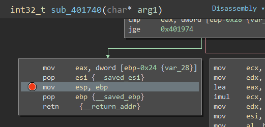

+++
title = "Cyber Talents Mini CTF Week 3"
date = 2021-02-21T22:59:01+11:00
lastmod = 2021-02-21T22:59:01+11:00
tags = ['CyberTalents', 'Mini CTF']
categories = ['CTF']
imgs = []
cover = ""  # image show on top
readingTime = true  # show reading time after article date
toc = true
comments = true
justify = false  # text-align: justify;
single = true  # display as a single page, hide navigation on bottom, like as about page.
license = ""  # CC License
draft = false
+++


# Info

This was the third one of the Cyber Talents February weekly mini CTFs. [Link here](https://cybertalents.com/competitions/mini-ctf-week-1)

There were 5 challenges:


# detector


> is an open-source, free and lightweight network intrusion detection system (NIDS) software for Linux and Windows to detect emerging threats.

A Google search shows "Snort". Tried it and it's the correct answer.

# LOUDER

At the start, we were given a hyper link to an [audio file](morse.wav)

By the file name and the sound in the audio file we can guess that it's morse code.

With an audio processing software (e.g. [Audacity](https://www.audacityteam.org/)), we can easily transcript the morse code:


Transcripted below ("`/`" denoting word separation, since space is used for letter separation):

```
- .... . / ..-. .-.. .- --. / .. ... / .. / .- -- / ... .--. . .- -.- .. -. --. / .-.. --- ..- -.. . .-. / - .... .- -. / -... . ..-. --- .-. .
```

Translate the code above on [dcode.fr](https://www.dcode.fr/morse-code) we can get the following text:

```
THE FLAG IS I AM SPEAKING LOUDER THAN BEFORE
```

After trying several times of submission, I figured out the flag is 

`flag{I AM SPEAKING LOUDER THAN BEFORE}`.

# Find the map

We were given a [Windows executable file](Find_The_map.exe). 

This challenged was marked "Easy". But according to my observation, this was the last challenge everyone who solved it solved :D


## Running the program

Running the program gave us the following output:


Hmm. Not much information.

## A bird eye view

Running `string Find_the_map.exe` to extract strings from the file, something quite noticable showed up:

```
=>MAP=>||MHg0MDE3NDA9PjB4NDAxMDgwPT4weDQwMUJDMD0+MHg0MDE5ODA9PjB4NDAxNTAwPT4weDQwMTJDMA==||
```

The word "MAP" corresponds to the output of the program and hints in the description. So this must be some clue. And the following part looks like a base64 string. 

So base64 decode it:

```
$ echo MHg0MDE3NDA9PjB4NDAxMDgwPT4weDQwMUJDMD0+MHg0MDE5ODA9PjB4NDAxNTAwPT4weDQwMTJDMA== | base64 -d
```

We got:
```
0x401740=>0x401080=>0x401BC0=>0x401980=>0x401500=>0x4012C0
```

Looks like 6 **instruction addresses** chained by arrows.

## Disassembly

It's time to the real "Reverse Engineering" part.

First of all, let's look at the `main` function of this program:


By examining data `0x40410c`, `0x4040d8` and `0x4040a4` we can guess that function `sub_401040` is somehow a printing function. 

Followed by that is 6 functions being called. And hey, those functions are the addresses from the "Map" we found above!


See?

So I guessed that the "Map" might be indicating the sequence of those functions *should* be executed, instead of the sequence they are arranged in the original program.

The value of the arguments passed to those 6 functions can be found in this memory segment:


Let's make it a table for later use:

| Function Name | Arg. Address | Arg. Value Hex | 
| -- | -- | -- |
| sub_401bc0 | `0x404074` | `21 48 73 63 20 6d 00 00` | 
| sub_401500 | `0x40407c` | `22 29 4a 22 22 4a 00 00` | 
| sub_401080 | `0x404084` | `61 6f 3a 49 3d 79 00 00` |
| sub_4012c0 | `0x40408c` | `2e 77 2e 7d 42 20 00 00` |
| sub_401740 | `0x40409c` | `3d 74 54 61 66 56 00 00` |
| sub_401980 | `0x404094` | `77 6d 47 3a 22 36 00 00` |

We can see that all of these parameter values are composed of 6 bytes terminated by 2 `0x00` bytes. This is another aspect of similarity of these 6 functions.

But what does those functions do?

## Function analysis

Having a quick glance of those 6 functions, they look extremely similar. So I guessed that they all do similar things. Below is a comparison of the decompile code of the functions (Only 3 listed, but you got the idea):


So I decided to give the first function in the "Map" (i.e. `sub_401740`) a detialed look and try to figure out what it does.

The argument passed to `sub_401740` is the data at `0x40409c`, according to what we found in the `main` function:


Now let's look into function `sub_401740` with assembly graph view for better understanding:


We can see that this function takes 1 argument. And in the case in the `main` function, the argument passed to this function is address `0x40409c`.

In block 1, the program save a copy of `arg1` in variable `var_24` (`@ebp-0x20`), then saved the byte address after `arg1` into variable `var_30`(`@ebp-0x2c`). Now those 3 pointers looks like this:

```
			   var_2c = 0x40409d
			   |
			   V
0x40409c	3d 74 54 61 66 56 00 00
			^
			|
			arg1, 
			var_24 = 0x40409c
```

Block 2 is a loop. It reads the byte to which `var_24` is pointing into `al`, increases `var_24` by 1 to point to the next byte, and examine the value of `al`, until the value of `al` is `0x00`. When the loop is done, `var_24` and `var_2c` would be like this:


```
			   var_2c = 0x40409d
			   |
			   |              al = 0x00
			   |              ^
			   V              |
0x40409c	3d 74 54 61 66 56 00 00
			                     ^
			                     |
			                     var_24 = 0x4040a3
```


At the beginning of block 3, the program substracts `var_30` from `var_24`, and stored it into `var_34`. This value is equal to the length of the array before `0x00` element, or the string length. And we know this length would be 6.

The value of `var_34` is then saved to another variable `var_14`. By examining the following part of this function, we can find that `var_14` is never written again, only read. So we can rename `var_14` as `STR_LEN` to make it easier to read.

Next let's take a further look at block 3:


After calculating the string length, the program calls `malloc` 3 times and save the heap addresses into variables `var_10`, `var_20` and `var_28`. By debugging this function and setting breakpoints, we can see that the memory allocated for `var_10` and `var_20` are 6 bytes long, and for `var_28` is 7 bytes long.

Then I got a feeling. Those 3 buffers might be used to store data towards the final answer. 

## In debugger

So I jumped to the end of the function, set a breakpoint right before the function prepares to return, and examined the values of the 3 buffers when the program gets there. Here's we're paused at:



Here's what I found:


| Buffer | Value |
| --- | --- |
| var_10 | `x3mZZh` |
| var_20 | `x3mZZh` |
| var_28 | `ZmxhZ3\x00` |

The value of buffer `var_28` looks more like something ready to output, because it's a string ending with `0x00`. Plus, if you look at the ending part of this function, you can see that the value of `var_28` is set as the return value of this function (saved to `eax`):


So I looked at the string `ZmxhZ3` and thought: Hey, this looks like a base64 string. So I tried to base64 decode it, and I got:


Hey! It decoded as "`flag`"! It must be the beginning of "`flag{blablabla}`". We're on the right track!

So I repeated the process above	steps, and here are the buffer `var_28` values I found in all 6 functions:

| Function | Buffer `var_28` value |
| --- | --- |
| sub_401bc0 | `cmF0c1` |
| sub_401500 | `Z290X0` |
| sub_401080 | `tDb25n` |
| sub_4012c0 | `1lfQ==` |
| sub_401740 | `ZmxhZ3` |
| sub_401980 | `95b3Vf` |

And I concatenated those strings in the order of the "Map", i.e. `0x401740=>0x401080=>0x401BC0=>0x401980=>0x401500=>0x4012C0`. And I got:

```
ZmxhZ3tDb25ncmF0c195b3VfZ290X01lfQ==
```

Base64 decode it, we got:

```
flag{Congrats_you_got_Me}
```

# Slack

We were given a [RAR archive file](Slack.rar).

After extracting this archive, we get a directory:


Whoa. That's, a lot.

After exploring around the sub-directories, this looks like a user data directory of some browser to me.

The `Cookies` file caught my attention. This might contain user credentials of user session info.


Looks like it's a SQLite database file. Let's try:


Now we've got ourselves some cookies :)

Next I tried to find clues in other files. First I tried looking for the word "flag" in all the files:

```bash
for i in $(find . -type f); do grep -l -i 'flag' "$i"; done
```

Some file names showed up:


Upon checking all these files, the `./IndexedDB/https_app.slack.com_0.indexeddb.blob/1/00/3` was most interesting. It seems to contain some data from a Slack chat:


Very messy, but still there's something readable in it. We can read something about the flag and a Pastbin account.

I spent very long time trying to restore the chat messages from this file, with no luck.

Then I thought, what else could be interesting inside this file? Maybe URLs.

So next, I searched for "http" inside this file. Many things came up: Slack icon files, announcement for new Slack features, etc.

But finally I spotted this one:

```
https://challenges-co.slack.com/team/U01M6JZ7D37
```

This is a link to a slack team chat. Then I tried to login to this Slack in browser:


I was asked to login! (Yeah of course, what do you expect?)

But remember the cookies we found before? Very likely we can use those cookies to steal a session. So I opened the developer's console and filled in the cookies we found just now:


I tried to create a cookie named "x" and fill in the value. But somehow every time I hit enter, the entry is gone. So I left it alone and tried logging in again anyway. And we got:


Voila! In we are.

Here we confirmed the chat messages we read in the messy file. And there is a base64 string:

```
cGFzc3dvcmQ6IEdTaGVreFc3UmE=
```

(%3D is URL-encoded "`=`")

Decode the base64 string:

```
password: GShekxW7Ra
```

We got a password. But what for?

The chat mentioned a Pastbin account. But what would be the user name of the account?

Since the Slack user we are impersonating now is "c8540731", I decided to try this user name on Pastebin. The user profile URLs on Pastebin are in format: `https://pastebin.com/u/<username>`. So I put `https://pastebin.com/u/c8540731` in my browser's address box.

And guess what:


Then I clicked the "Flag" file. It asked me for a password:


I entered the password we found in the Slack chat (`GShekxW7Ra`), and got the file:


# Murphy

We were given a [link to a website](http://18.198.209.150:5000/)

The website index looks like this:


There's no link to other paths in this page. Only the "Home" link on the top left corner, which links to this page itself.

On some further trials, I found that whatever path I go to, it's always the same page:


But if you check the source of this page, you can find that it's not quite the same. The URL path is reflected in the "Home" link:


Meanwhile, I also tried to `wfuzz` the paths, and got some intresting results:


I found that the server returns 500 status when the path contians non-ASCII characters. Also, from the response headers we can see that the backgroud is running Python, probably Flask:


Thus I guessed that the URL path is somehow programmaticaly processed in the backend. 

Very likely it's populating a template. This gives us the chance for SSTI.

Therefore, I tried to do some simple injection to confirm my guess. I gave the server `{{ 1+1 }}` in the path:


We can see the expression we passed in the path is evaluated.

Next I tried this payload:

```
/{{request.application.__globals__.__builtins__.__import__('os').popen('id').read()}} 
```

And I got:


This confirms that we can run shell commands.

Then I tried to read `/etc/passwd` file:


And there the flag is.

Plus, I also grab the [backend source code](run.py).
