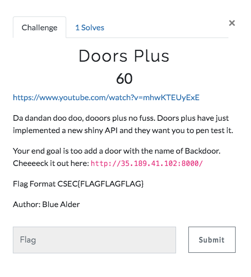
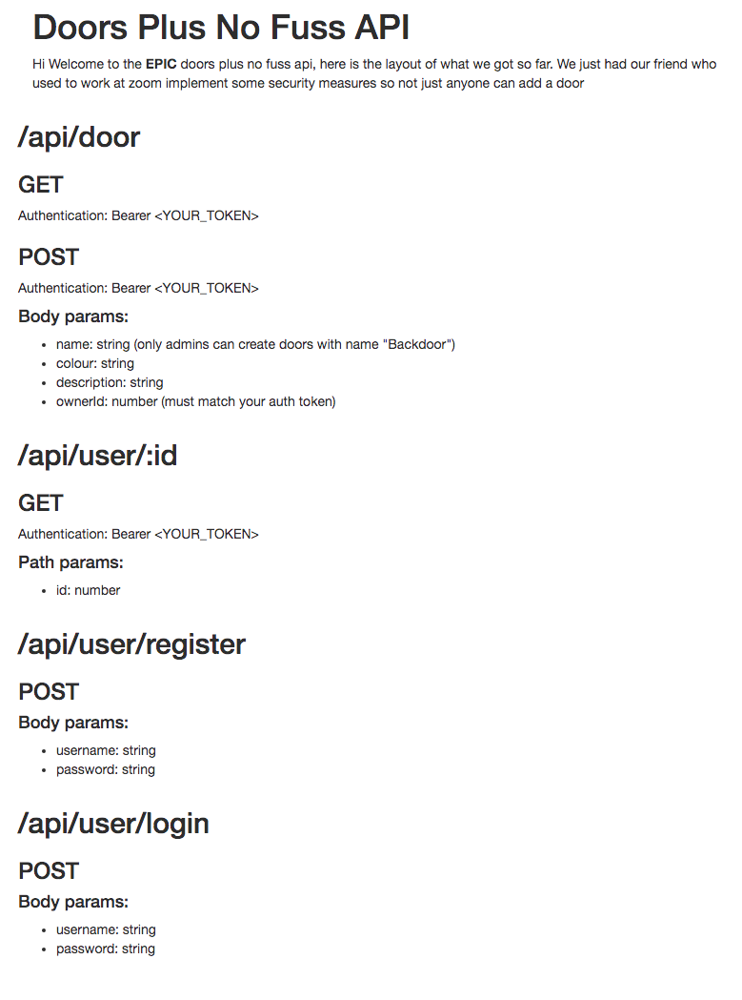
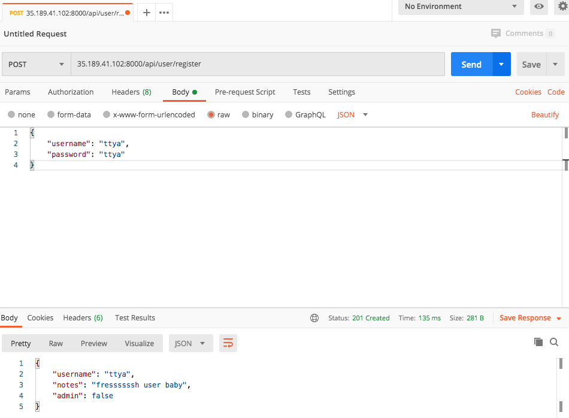
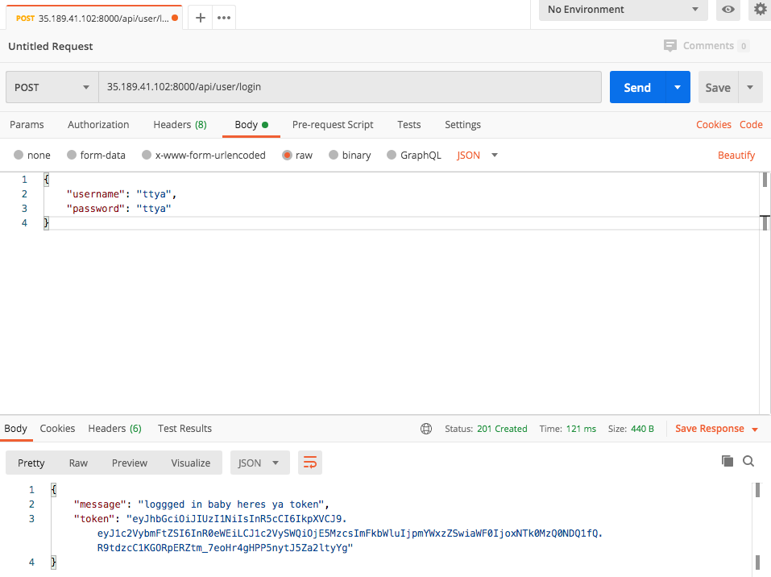
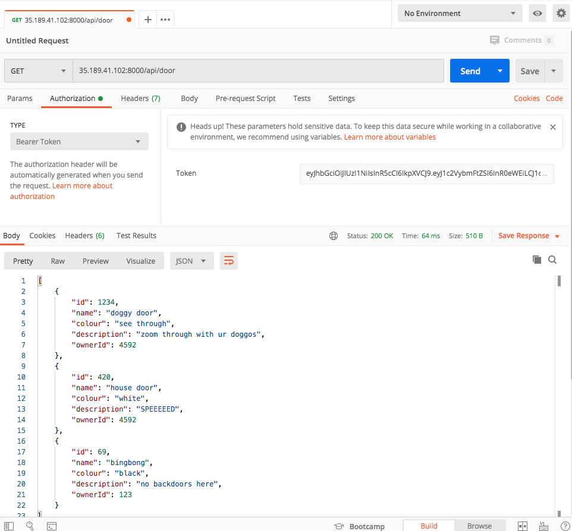
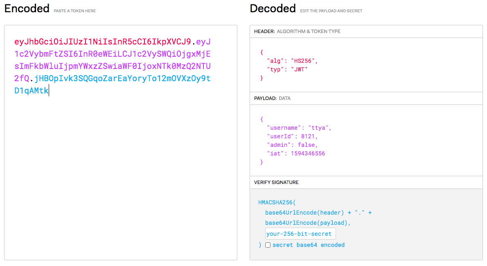
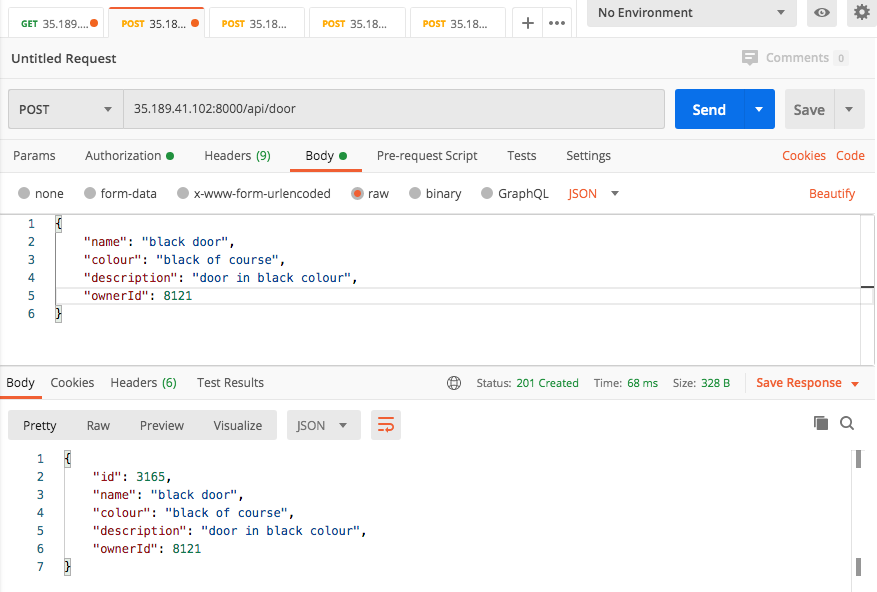
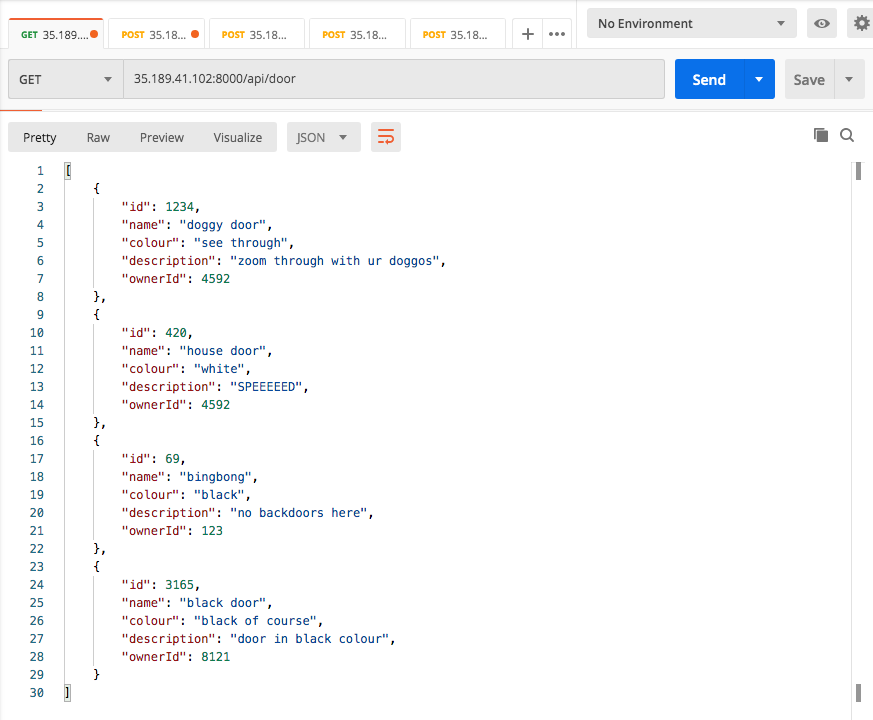
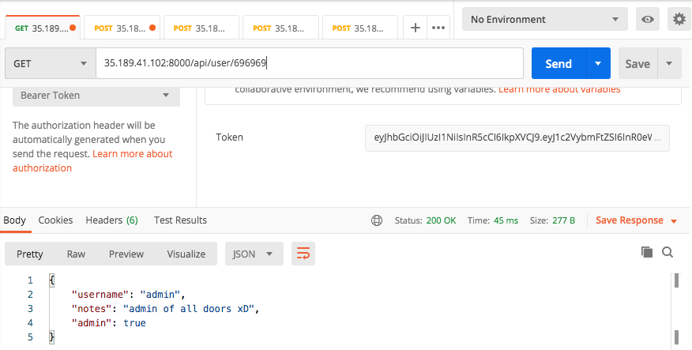
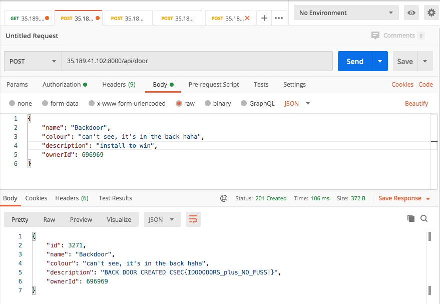

+++
title = "CSEC CTF: Doors Plus"
date = 2020-07-10T10:38:34+10:00
lastmod = 2020-07-10T10:38:34+10:00
tags = ["csec", "web"]
categories = ["CTF"]
imgs = []
cover = ""  # image show on top
readingTime = true  # show reading time after article date
toc = true
comments = true
justify = false  # text-align: justify;
single = true  # display as a single page, hide navigation on bottom, like as about page.
license = ""  # CC License
draft = false
+++


# Challenge Info

This is a challenge from the UTS Cyber Security Society (CSEC) Semester-long CTF for 2020 Autumn session.

Link: [here](https://ctf.utscyber.org/challenges#Doors%20Plus)



# Let's look around

So the challenge starts with a URL (not the YouTube link!). Go to that link we see:



Seems this website provides a set of web API. And our objective, as described, is to create a door named "Backdoor".

Firstly I tried to send a GET request to `/api/door` with Postman:


I got a 403 error. Seems the authentication is a real deal. Well then, let's become a legal user and get authenticated, by calling `/api/user/register` and `/api/user/login`.

Register:



Login:



So by sending my credentials in JSON format to `/api/user/register` and then to `/api/user/login` I got myself a token. With this token I should be able to access the APIs need authentication.

Well let's try `/api/door` again with this token:



Cool! There are already some doors, and this API call seems to list them all.

Then I wanted to try adding a door. According to the API reference, I need to provide my user ID as `ownerId` argument. But so far I didn't know my ID yet.

The token seems to be a [JWT](https://jwt.io). So I tried to decode the token and see what it contains:



So my `userId` is 8121, and I'm not a admin. Now we can try adding a door:



It returned with the info of the door I just created. And let's run a GET on this API again:



Our newly created doors is listed!

Next I tried `/api/user/:id`. First I give it a go with my own ID:


Yes, it's me. It's my username, and I'm not a admin.

Now I should try another ID. We can try all other IDs seen in the door list:


ID 4592


ID 123

Curious. ID 123 does not exist. 

Seems as a registered user, I can see other users' info, even if I'm no admin. It's just natural to enumerate the numbers and see what we can get.

From previous tests we know that the status code of the response to GET `/api/user/:id` request will be `200` if the user ID exists, or `400` if the user ID doesn't exist. So we can make a simple Python script to do this for us: enumerate through a lot of integers, and print the user info if the user ID exists.

I'll show you the code:

```Python
import requests

base_uri = 'http://35.189.41.102:8000/api/user/'
headers = {'Authorization': 'Bearer eyJhbGc... <your token here>'}

for i in range(100000):
	print('\r%d' %i, end='')
	r = requests.get(base_uri + str(i), headers=headers)
	if r.status_code == 200:
		print()
		print(r.json())

```

After several minutes of numbers flashing, I found there are much more users than I imagined, and something interesting showed up:


Funny you mentioned that. What would happen if I look into user ID 696969? Let's find out:



Hah! 696969 is the admin!

However, I'm clueless now. How am I gonna POST a door as the admin? The API reference says the `ownerId` must match my auth token...

Wait a sec!

 What if I try POSTing a door with my own token and filling the `ownerId` field 696969?

 Wouldn't hurt, right? 

 (A sensible API design wouldn't even leave such a field for the client to fill, since all the doors can only be owned by whoever created them by design)

So. Ready, aim, fire!



Haha! We got it!
