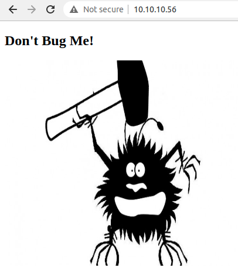
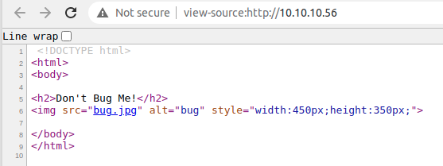
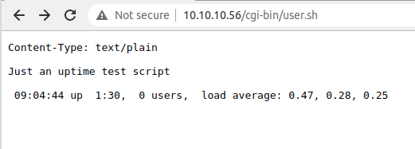
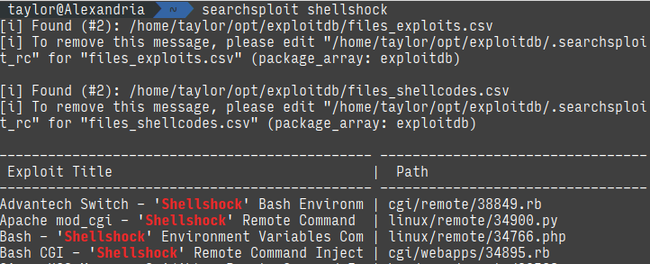
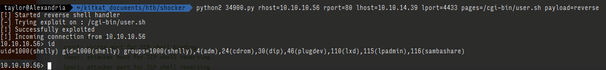
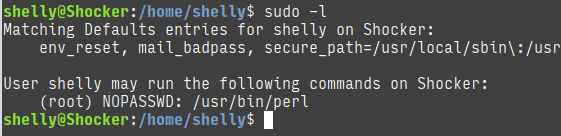
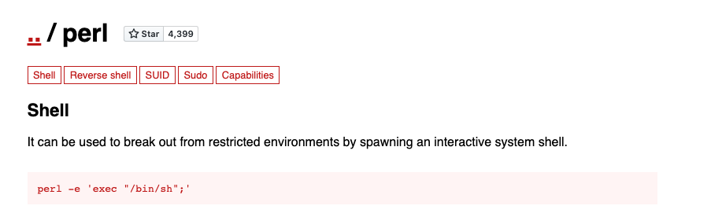
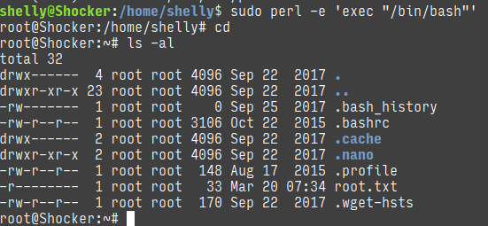

+++
title = "Shocker - HackTheBox"
date = 2021-03-21T00:36:18+11:00
lastmod = 2021-03-21T00:36:18+11:00
tags = ["HackTheBox", "TJnull's List", "Shellshock"]
categories = ["Boot2Root"]
imgs = []
cover = "https://www.hackthebox.eu/storage/avatars/efef52a0fb63d9c8db0ab6e50cb6ac79.png"  # image show on top
readingTime = true  # show reading time after article date
toc = true
comments = true
justify = false  # text-align: justify;
single = true  # display as a single page, hide navigation on bottom, like as about page.
license = ""  # CC License
draft = false
+++

# Info 

[Machine Profile](https://www.hackthebox.eu/home/machines/profile/108)

# Recon

Nmap scan shows 2 open ports:

```
Starting Nmap 7.91 ( https://nmap.org ) at 2020-11-11 21:20 AEDT
Nmap scan report for 10-10-10-56.tpgi.com.au (10.10.10.56)
Host is up (0.015s latency).

PORT     STATE SERVICE VERSION
80/tcp   open  http    Apache httpd 2.4.18 ((Ubuntu))
|_http-server-header: Apache/2.4.18 (Ubuntu)
|_http-title: Site doesn't have a title (text/html).
2222/tcp open  ssh     OpenSSH 7.2p2 Ubuntu 4ubuntu2.2 (Ubuntu Linux; protocol 2.0)
| ssh-hostkey: 
|   2048 c4:f8:ad:e8:f8:04:77:de:cf:15:0d:63:0a:18:7e:49 (RSA)
|   256 22:8f:b1:97:bf:0f:17:08:fc:7e:2c:8f:e9:77:3a:48 (ECDSA)
|_  256 e6:ac:27:a3:b5:a9:f1:12:3c:34:a5:5d:5b:eb:3d:e9 (ED25519)
Service Info: OS: Linux; CPE: cpe:/o:linux:linux_kernel

Service detection performed. Please report any incorrect results at https://nmap.org/submit/ .
Nmap done: 1 IP address (1 host up) scanned in 7.94 seconds
```

Then we shall run a gobuster enum:

```bash
gobuster dir --add-slash -u http://10.10.10.56 -w /home/taylor/opt/DirBuster-Lists/directory-list-2.3-small.txt
```

While gobuster running, let's go to the website with a browser as well:




Not quite interesting. The source of this page is not quite interesting as well:



Meanwhile gobuster found something interesting:

```
===============================================================
Gobuster v3.1.0
by OJ Reeves (@TheColonial) & Christian Mehlmauer (@firefart)
===============================================================
[+] Url:                     http://10.10.10.56
[+] Method:                  GET
[+] Threads:                 10
[+] Wordlist:                /home/taylor/opt/DirBuster-Lists/directory-list-2.3-small.txt
[+] Negative Status codes:   404
[+] User Agent:              gobuster/3.1.0
[+] Add Slash:               true
[+] Timeout:                 10s
===============================================================
2021/03/21 01:08:22 Starting gobuster in directory enumeration mode
===============================================================
/cgi-bin/             (Status: 403) [Size: 294]
```

The presence of `/cgi-bin/` directory means that this server is potentially vulnerable to shell shock. 

# Foothold

So let's run another enum within the `/cgi-bin/` directory, targeting potential CGI scripts or programs:

```bash
gobuster dir -x "sh,pl" -u http://10.10.10.56/cgi-bin -w /home/taylor/opt/DirBuster-Lists/directory-list-2.3-medium.txt
```

Because it's probably a script, so we try to find `.sh` and `.pl` extentions. And I found something:

```
===============================================================
Gobuster v3.1.0
by OJ Reeves (@TheColonial) & Christian Mehlmauer (@firefart)
===============================================================
[+] Url:                     http://10.10.10.56/cgi-bin
[+] Method:                  GET
[+] Threads:                 10
[+] Wordlist:                /home/taylor/opt/DirBuster-Lists/directory-list-2.3-medium.txt
[+] Negative Status codes:   404
[+] User Agent:              gobuster/3.1.0
[+] Extensions:              sh,pl
[+] Timeout:                 10s
===============================================================
2021/03/21 00:01:41 Starting gobuster in directory enumeration mode
===============================================================
/user.sh              (Status: 200) [Size: 118]
```

And this is how it looks like when accessed through a browser:



In order to exploit shell shock vulnerability, I searched with `searchsploit`:



And I chose `linux/remote/34900.py`:

```bash
searchsploit -m linux/remote/34900.py
```

By running this exploit, I got a reverse shell:



# Escalation

After logging in as shelly, I did a quick `sudo` check:



We can run `perl` as root without providing password. That's too sweet. 

A simple search on [GTFOBins](https://gtfobins.github.io/) found this:



So I ran this command with `sudo`:



And I'm root ;)


