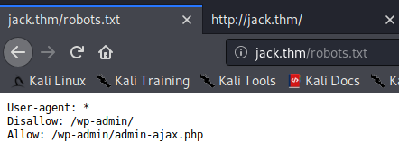
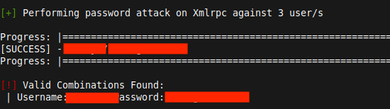

+++
title = "Jack - TryHackMe"
date = 2020-10-03T00:17:00+10:00
lastmod = 2020-10-05T00:10:57+11:00
tags = ["TryHackMe", "WordPress", "WPscan", "Python", "Python module"]
categories = ["Boot2Root"]
imgs = []
cover = "https://i.imgur.com/SRmSCVZ.png"  # image show on top
readingTime = true  # show reading time after article date
toc = true
comments = true
justify = false  # text-align: justify;
single = true  # display as a single page, hide navigation on bottom, like as about page.
license = ""  # CC License
draft = false
+++

# Info

This is a room from [TryHackMe](https://tryhackme.com). 

[Link to the room](https://tryhackme.com/room/jack)

If you have any questions, or want to discuss anything with me, please leave a comment or find me through methods listed in [About Page](/about)

# Recon

First thing first, add domain name to `/etc/hosts` as described:


As usual, do a port scan:


We found ports 22 and 80 open on this host. Then the next thing would be doing a fingerprint scan on these ports:


So it's a OpenSSH server, and a Apache web server. The website might be built with WordPress.

Next step, while I poke around the website, I'll also put a directory enumeration running in background:

```bash
gobuster dir -x "php,txt,html,xxx,bak,old" -u http://jack.thm --wordlist /usr/share/wordlists/dirbuster/directory-list-2.3-medium.txt | tee gobuster.log
```

Okay. Let's go and see what we can find in the website.

Looking at the frontpage, 1 article is listed. Except that, no more interesting links are present.


On this article page, all the links present point this page itself. Besides, there is a comment form.


Let's try leaving a reply here:


Seems our reply is held for moderation:


One more thing, let me check `robots.txt`:



Let's go back and look at `gobuster`. It has already come with some interesting results:


I'll turn over all these stones one by one, starting with static ones such as `/license.txt` and `/readme.html`, then dynamic, WordPress-related ones.

`/license.txt` seems just a license comes with WordPress, not quite informative:


`/readme.html` seems also a default file coming with WordPress:


All other paths either requires login, or provide nothing interesting as well. So far it's pretty much what I can do with the website, without any particularly interesting discoveries.

# Vulnerability Scan

Since I've already have some key information about the attack surface (the WordPress server), now it might be a good time to run a Nessus scan. To do this, I selected "Web Application Tests", and put our target domain name in to "Targets" field.


This scan took quite a long time. Maybe I should have refine and customise it a bit.

Anyway, the scan reported that this WordPress server is vulnerable to user name enumeration:


So now we have several usernames:

* jack
* wendy
* danny

Next, to conduct a more spcific examination on WordPress, I ran `wpscan` against this server. This scan shows no plugin on this server, and a brief research on this WordPress version didn't show any feasible exploitation for now (All need authentication or are XSS exploitation, and would be infeasible for now because neither I have a valid credentials nor are other people accessing this server)


I read the hint provided by this room:


I actually went to check on what `ure_other_roles` is, and turns out it's and exploitable plugin, which I didn't see from the scan reports above and won't be exploitable until we have some valid credentials. So "don't use tools" must mean bruteforcing the password.

# Password Bruteforcing

So I saved the usernames I found into `users.txt` and ran a password bruteforcing with `rockyou.txt`:

```bash
wpscan --url http://jack.thm -P ../../rockyou.txt -U users.txt -t 20
```

After leave it running for 15 minutes I began to doubt. A challenge involving bruteforcing normally won't require this long time. I am either using a wrong wordlist, or on the wrong track. The progress bar even remained unchanged during the 15 minutes because it's too big a wordlist.

I took a look in the forum, and somebody mentioned [fast track wordlist](https://github.com/trustedsec/social-engineer-toolkit/blob/master/src/fasttrack/wordlist.txt). So I decided to have a try on this one. I downloaded and saved it as `fasttrack.txt`, and ran


```bash
wpscan --url http://jack.thm -P ../../fasttrack.txt -U users.txt -t 20
```

And this time we were able to find a combination! (Geez, how would I ever know this if it was not people talking about this wordlist)



With this, we can now log into WordPress, and hopefully exploit some escalation. Let's navigate to `/wp-admin.php` and login.


# Become WordPress Admin

Cool! We are in. But we are not an admin. Maybe now is the time where the `ure_other_roles` hint comes in place.

[I found a blog](https://windsorwebdeveloper.com/dc-6-vulnhub-walkthrough/) which mentioned how to exploit this POST argument. It is done by modifying the POST request when updating user profile.

So I turned burp interception on:


Then clicked "Update Profile" in the Profile tab:


Then when burp catches this request, I appended `&ure_other_roles=administrator` to the request arguments and forwarded the request:


And voila! We are admin now:


# Foothold

Now that we can mess with plugins, next thing came to my mind was to upload a web shell.

I searched in Metasploit, and found exploit `unix/webapp/wp_admin_shell_upload`, and configured it as follow:


And ran `exploit`.

After waiting a short while, we got a meterpreter connection:


Now we got a foothold, and by retrieving `/etc/passwd` we can see a user called jack:


Then I listed jack's home directory, found that we can read the user's flag:


# A Better Shell

There's another interesting file `reminder.txt`. The content of this file is listed below

> Please read the memo on linux file permissions, last time your backups almost got us hacked! Jack will hear about this when he gets back.

Well, at this stage I didn't know much about what this reminder talks about yet. Based on this, I guess the next step would be something about misconfigured file permission. Let's keep looking around.

With the clue of "backups" mentioned above, I checked the `/var/backups` directory, and found a file which looks like a RSA private key with very dangerous permissions:


So I saved this file to my local machine, and set the permissions on this file to `600`

```bash
chmod 600 id_rsa
```

Then I tried if I can login to any user on the target machine. And yes, turns out we can:


# Local Escalation

Now that we've got a SSH session, it would be much easier to perform a local enumeration. First, upload `LinEnum.sh` script from my local machine:

```bash
local-machine$ scp -i id_rsa ../../LinEnum.sh jack@jack.thm:
```

And then on the target machine:

```bash
jack@jack:~$ ./LinEnum.sh > /tmp/jack-enum.log
```

This will run the local enum and save the report to `/tmp/jack-enum.log`.

But this local enumeration didn't bring up anything interesting. I got stuck for quite a while.

Then the hint under the title came to my notice:


What kind of Python module would be vulnerable for escalation?

So I thought, it would be either a vulnerable Python module installed on this machine, or we are gonna perform a module hijacking on some Python program run with root permission.

Then I first tried to research if there are such vulnerable modules. Didn't find anything applicable. 

Next, I tried to find somewher to perform module hijacking. Since the local enumeration found no expoitable SUID files, then the program to hijack is most likely run by cron. 

So I tried to investigate Python programs running on this machine. To do this, I used [pspy](https://github.com/DominicBreuker/pspy). And this time, the result was exciting: there is a Python script getting run every 2 minutes:


So I immediately went to check this file, see if I can module-hijack.


Basically, this program imports `os` module, grabs the content from the local webserver, and appends the respond to `output.log`.

In order to perform module hijack, I can write some Python code and save to `/opt/statuscheck/os.py`. But, uh... Seems I cannot write to this directory:


I must need some other method to do this.

I then tried to investigate the directory where the `os` module resides with the command:

```bash
ls -al /usr/lib/python2.7
```

and found that the permissions on these files are quite funny:


They can be edited by users in the `family` group. I then checked the current user's groups:


Guess what? We are `family`!

So we actually can directly edit `/usr/lib/python2.7/os.py`, even simpler than the hijacking bullshit.

Now then there are countless ways we can read root's flag. What I actually did is appending these reverse shell code at the end of `os.py`:


and on my local machine, ran

```bash
local-machine$ nc -lvnp 8889
```

After waiting a while for the next run of the script, we are in as root!


