+++
title = "牛年灯谜 CTF Writeup Part 2"
date = 2021-02-14T05:12:00+11:00
lastmod = 2021-02-14T05:12:00+11:00
tags = ["Year of Ox"]
categories = ["CTF"]
imgs = []
cover = ""  # image show on top
readingTime = true  # show reading time after article date
toc = true
comments = true
justify = false  # text-align: justify;
single = true  # display as a single page, hide navigation on bottom, like as about page.
license = ""  # CC License
draft = false
+++

[Part 1](https://tay1or.li/post/year-of-ox-ctf-writeup-zh/)

第二个红包虽然增加了一些难度，但我认为对于即便新手来说仍然是有机会通过观察和少许研究解出的。所以我仍然打算配上较为详细的、尽可能不假设前置知识的推理和解题过程。

# 第二个红包

tl;dr

网页上有一个链接（洋文诗），链接指向服务器上的一个文本文件 `/lines-written-in-early-spring.txt`。内容如下：

```
Lines Written in Early Spring
OM JOWTQSZ KHCXFWFTTS

M uhaiq o gnzcasar uwyadvf nzxrv,
Wyvzr oy i ojbjx T mntv tenpvqeu,
Vb gnlb aorsm xibd njey tyhajnbg zswcyuhl
Mlvnx uao xuruxuhf zz bpw zwgo.

Nb hvt flme zoixg qoo Vilhfx wcak
Kje syzdn jbiy zsib lufhfau mv tay;
Eag mlpv vz rzqwisw xs uertt es gkiex
Kuge uif uol xuqe fh mlr.

Gkrfhuu vcqujbgx eostj, kn elnw girsa hzemj,
Gvx ayeinknvpr wrrvzrj tba oestebf;
Aef ’ttw zb frvhu zsib wiskj zyongr
Prwryj gvr gtz ql ofxlnuej.

Vhp fvudj nfbayl uw uciayq aef pwelhd,
Kusvx epwmtvmd C paepoe qrdsles:—
Oae bpw ystdn zokkoy aulcy gvre xilw
Vh lpyzeu c tsvvol fs dyklacjr.

Hap vhduknr xjlgj fdekll wmg hapce frp,
Tz gnwcy gvr hcmmrl obc;
Uad Z oudx gkiex, rb gwt Q unb,
Msug tygrp anv pcrofacm bzrfx.

Tz ghzu bppvhf wecz npidwa px dyat,
Zh sfgu ee Enhhxp’a pgym iwua,
Hrxe T rbw rvngbt ew tszsge
Quak oay lnv mrqs bl xiv?

Lus ilmfwftd tw: pkimrdbxv
```

搜索“Lines Written in Early Spring”可以找到[这首诗的原文](https://www.poetryfoundation.org/poems/51001/lines-written-in-early-spring)。

对照原文可以解出 Vigenère Cipher 的密钥：nongliisnotlunarcalendar

由此解密出密文中的最后一行的内容：The password is: chivepork

提示信息「什么机制可以让一个网站告诉搜索引擎：“请索引这些路径”“不要看这些地方”？」所指的是 /robots.txt 文件。

访问网站的 /robots.txt 文件发现了 `Disallow: /dumpling.zip`

下载并使用上文中得到的密码 chivepork 解压 dumpling.zip 文件，得到文件“什么馅.txt”，其内容是下一个红包的网页路径 `/level-2-gVXe4lR5NwT986ALEl7x.html`。

下面是详细解释。

## Vigenère Cipher

在这个页面中，你大概会不可避免地注意到一个超链接：

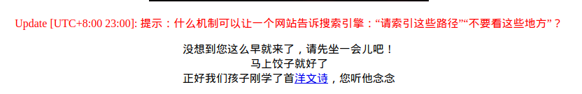 

点进这个链接你会看到如下内容：

```
Lines Written in Early Spring
OM JOWTQSZ KHCXFWFTTS

M uhaiq o gnzcasar uwyadvf nzxrv,
Wyvzr oy i ojbjx T mntv tenpvqeu,
Vb gnlb aorsm xibd njey tyhajnbg zswcyuhl
Mlvnx uao xuruxuhf zz bpw zwgo.

Nb hvt flme zoixg qoo Vilhfx wcak
Kje syzdn jbiy zsib lufhfau mv tay;
Eag mlpv vz rzqwisw xs uertt es gkiex
Kuge uif uol xuqe fh mlr.

Gkrfhuu vcqujbgx eostj, kn elnw girsa hzemj,
Gvx ayeinknvpr wrrvzrj tba oestebf;
Aef ’ttw zb frvhu zsib wiskj zyongr
Prwryj gvr gtz ql ofxlnuej.

Vhp fvudj nfbayl uw uciayq aef pwelhd,
Kusvx epwmtvmd C paepoe qrdsles:—
Oae bpw ystdn zokkoy aulcy gvre xilw
Vh lpyzeu c tsvvol fs dyklacjr.

Hap vhduknr xjlgj fdekll wmg hapce frp,
Tz gnwcy gvr hcmmrl obc;
Uad Z oudx gkiex, rb gwt Q unb,
Msug tygrp anv pcrofacm bzrfx.

Tz ghzu bppvhf wecz npidwa px dyat,
Zh sfgu ee Enhhxp’a pgym iwua,
Hrxe T rbw rvngbt ew tszsge
Quak oay lnv mrqs bl xiv?

Lus ilmfwftd tw: pkimrdbxv
```

除了第一行是正常的英文，看起来像是标题，其他内容都是乱七八糟的。但这些内容有以下特征：

* 文本中仍然有空格、标点、换行；
* 空格隔开的字母序列看起来大致是单词的长度；

由此可以猜测，会不会这又是像上一关一样使用了字母替换加密？

------

先将这个猜测放在一边。这个文本中只有标题是明文，且这个标题与超链接中的文件名 `lines-written-in-early-spring.txt` 相符。一个标题出现了两次，这或许是一个线索。

搜索这个标题，发现的确有一首[这个标题的诗](https://www.poetryfoundation.org/poems/51001/lines-written-in-early-spring)。将找到的这首诗和上述文本对照：


<table>
	<tbody>
<tr style="vertical-align: top;">
	<td>
		<pre>
			<code>
Lines Written in Early Spring
OM JOWTQSZ KHCXFWFTTS<br>
M uhaiq o gnzcasar uwyadvf nzxrv,
Wyvzr oy i ojbjx T mntv tenpvqeu,
Vb gnlb aorsm xibd njey tyhajnbg zswcyuhl
Mlvnx uao xuruxuhf zz bpw zwgo.<br>
Nb hvt flme zoixg qoo Vilhfx wcak
Kje syzdn jbiy zsib lufhfau mv tay;
Eag mlpv vz rzqwisw xs uertt es gkiex
Kuge uif uol xuqe fh mlr.<br>
Gkrfhuu vcqujbgx eostj, kn elnw girsa hzemj,
Gvx ayeinknvpr wrrvzrj tba oestebf;
Aef ’ttw zb frvhu zsib wiskj zyongr
Prwryj gvr gtz ql ofxlnuej.<br>
Vhp fvudj nfbayl uw uciayq aef pwelhd,
Kusvx epwmtvmd C paepoe qrdsles:—
Oae bpw ystdn zokkoy aulcy gvre xilw
Vh lpyzeu c tsvvol fs dyklacjr.<br>
Hap vhduknr xjlgj fdekll wmg hapce frp,
Tz gnwcy gvr hcmmrl obc;
Uad Z oudx gkiex, rb gwt Q unb,
Msug tygrp anv pcrofacm bzrfx.<br>
Tz ghzu bppvhf wecz npidwa px dyat,
Zh sfgu ee Enhhxp’a pgym iwua,
Hrxe T rbw rvngbt ew tszsge
Quak oay lnv mrqs bl xiv?<br>
Lus ilmfwftd tw: pkimrdbxv
</code>
</pre>
	</td>
	<td>
		<pre>
			<code>
Lines Written in Early Spring
BY WILLIAM WORDSWORTH<br>
I heard a thousand blended notes,
While in a grove I sate reclined,
In that sweet mood when pleasant thoughts
Bring sad thoughts to the mind.<br>
To her fair works did Nature link
The human soul that through me ran;
And much it grieved my heart to think
What man has made of man.<br>
Through primrose tufts, in that green bower,
The periwinkle trailed its wreaths;
And ’tis my faith that every flower
Enjoys the air it breathes.<br>
The birds around me hopped and played,
Their thoughts I cannot measure:—
But the least motion which they made
It seemed a thrill of pleasure.<br>
The budding twigs spread out their fan,
To catch the breezy air;
And I must think, do all I can,
That there was pleasure there.<br>
If this belief from heaven be sent,
If such be Nature’s holy plan,
Have I not reason to lament
What man has made of man?<br>
</code>
	</pre>
	</td>
</tr>
</tbody>
</table>

可以发现：

* 通过比较对应位置的单词的长短，可以确认这个加密文本的明文的确是这首诗；
* 明文中重复出现的字母在密文中并不对应相同字母，说明并非简单的字母替换加密；
* 密文在最后比明文多一行，可能是关键信息。

根据上述观察，有经验的人不难猜到[维吉尼亚加密（Vigenère Cipher）](https://en.wikipedia.org/wiki/Vigen%C3%A8re_cipher)。对于没有经验的人来说，以上述分析作为线索或许也可以通过一些研究搞清楚 :)

如 [Part 1](/post/year-of-ox-ctf-writeup-zh/) 中提到的，恺撒加密的一个致命弱点是，它太容易被试出来了。而即便是改进后的、乱序的字母替换加密（如：A -> C, B -> M, C -> Q, ...），也可以通过字母出现的频率来猜测，如今借助计算机来暴力破解也用不了多久。而维吉尼亚加密通过引入一个密钥，让明文中相同的字母在不同位置出现时也不会加密为相同的密文字母，克服了上述弱点。

恺撒加密对明文中的所有字母指定了一个错位数（比如 13）；而维吉尼亚加密使用一个密钥为明文中的每个字母指定一个不同的错位数，例如：

明文：`HELLO`<br>
密钥：`CHASE`<br>
密文：`JLLDS`

（你可以在[这里](https://gchq.github.io/CyberChef/#recipe=Vigen%C3%A8re%5FEncode%28%27%27%29)自己尝试维吉尼亚加密）

可以看到明文中相同的字母在密文中变成了不同的字母。

通常情况下明文的长度比密钥长（得多），维吉尼亚加密的办法是不断重复密钥来匹配文本长度，例如：

密钥：`GYRO`<br>
明文：`I can eat glass, it won't hurt me`<br>
配对：`G YOR GYO OGYRO, GY ROG Y ROGY RO`<br>
密文：`O arb kyk uryjg, or nct'r yixr ds`

因此，当你获得了密文和足够长的明文之后，就可以反算上述步骤而得到密钥。

 这里有个小技巧：事实上当你把明文的内容当作密钥来解密密文的时候，得到的结果就是重复多次的密钥，[如这里所示](https://gchq.github.io/CyberChef/#recipe=Vigen%C3%A8re_Decode%28'BYWILLIAMWORDSWORTHIheardathousandblendednotesWhileinagroveIsatereclinedInthatsweetmoodwhenpleasantthoughtsBringsadthoughtstothemindToherfairworksdidNaturelinkThehumansoulthatthroughmeranAndmuchitgrievedmyhearttothinkWhatmanhasmadeofmanThroughprimrosetuftsinthatgreenbowerTheperiwinkletraileditswreathsAndtismyfaiththateveryflowerEnjoystheairitbreathesThebirdsaroundmehoppedandplayedTheirthoughtsIcannotmeasureButtheleastmotionwhichtheymadeItseemedathrillofpleasureThebuddingtwigsspreadouttheirfanTocatchthebreezyairAndImustthinkdoallIcanThattherewaspleasurethereIfthisbelieffromheavenbesentIfsuchbeNaturesholyplanHaveInotreasontolamenWhatmanhasmadeofman'%29&input=T00gSk9XVFFTWiBLSENYRldGVFRTCgpNIHVoYWlxIG8gZ256Y2FzYXIgdXd5YWR2ZiBuenhydiwKV3l2enIgb3kgaSBvamJqeCBUIG1udHYgdGVucHZxZXUsClZiIGdubGIgYW9yc20geGliZCBuamV5IHR5aGFqbmJnIHpzd2N5dWhsCk1sdm54IHVhbyB4dXJ1eHVoZiB6eiBicHcgendnby4KCk5iIGh2dCBmbG1lIHpvaXhnIHFvbyBWaWxoZnggd2NhawpLamUgc3l6ZG4gamJpeSB6c2liIGx1ZmhmYXUgbXYgdGF5OwpFYWcgbWxwdiB2eiByenF3aXN3IHhzIHVlcnR0IGVzIGdraWV4Ckt1Z2UgdWlmIHVvbCB4dXFlIGZoIG1sci4KCkdrcmZodXUgdmNxdWpiZ3ggZW9zdGosIGtuIGVsbncgZ2lyc2EgaHplbWosCkd2eCBheWVpbmtudnByIHdycnZ6cmogdGJhIG9lc3RlYmY7CkFlZiDigJl0dHcgemIgZnJ2aHUgenNpYiB3aXNraiB6eW9uZ3IKUHJ3cnlqIGd2ciBndHogcWwgb2Z4bG51ZWouCgpWaHAgZnZ1ZGogbmZiYXlsIHV3IHVjaWF5cSBhZWYgcHdlbGhkLApLdXN2eCBlcHdtdHZtZCBDIHBhZXBvZSBxcmRzbGVzOuKAlApPYWUgYnB3IHlzdGRuIHpva2tveSBhdWxjeSBndnJlIHhpbHcKVmggbHB5emV1IGMgdHN2dm9sIGZzIGR5a2xhY2pyLgoKSGFwIHZoZHVrbnIgeGpsZ2ogZmRla2xsIHdtZyBoYXBjZSBmcnAsClR6IGdud2N5IGd2ciBoY21tcmwgb2JjOwpVYWQgWiBvdWR4IGdraWV4LCByYiBnd3QgUSB1bmIsCk1zdWcgdHlncnAgYW52IHBjcm9mYWNtIGJ6cmZ4LgoKVHogZ2h6dSBicHB2aGYgd2VjeiBucGlkd2EgcHggZHlhdCwKWmggc2ZndSBlZSBFbmhoeHDigJlhIHBneW0gaXd1YSwKSHJ4ZSBUIHJidyBydm5nYnQgZXcgdHN6c2dlClF1YWsgb2F5IGxudiBtcnFzIGJsIHhpdj8KCkx1cyBpbG1md2Z0ZCB0dzogcGtpbXJkYnh2)

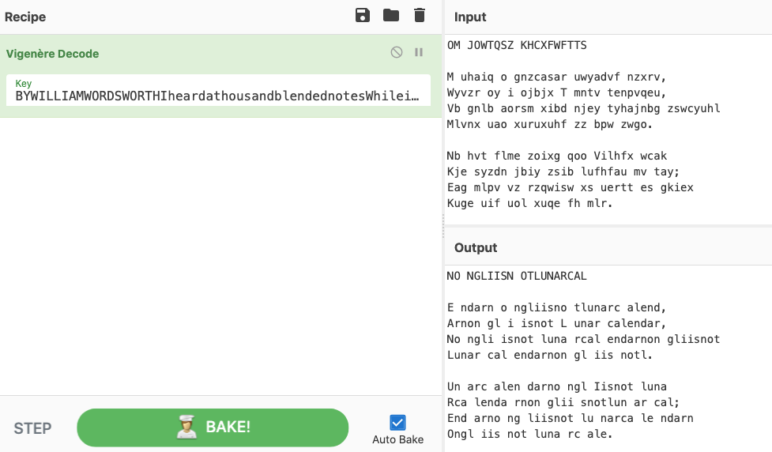

于是你能得出这段密文的密钥是：`nongliisnotlunarcalendar`

接下来再使用这个密钥解密，可以看到密文中最下面一行的内容是：

> The password is: chivepork

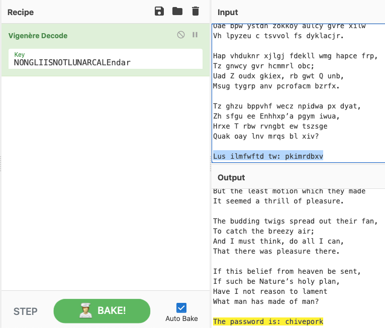

------

**题外话**：Nongli is not lunar calendar，这句话是我们刚才解出的密钥。

人们常常把农历称为“阴历”，而将现行的公历（[格里高利历](https://en.wikipedia.org/wiki/Gregorian_calendar)）称为“阳历”。即便在英语国家如澳大利亚，人们也常把农历新年称为“阴历新年（Lunar New Year）”。

格里高利历的确是阳历没有错，但农历并不是真正的（或者说，纯粹的）阴历。

所谓阳历是指力图让历法中的“年”这个时间单位与地球公转周期相同，即：1年≈365.2422天（回归年）或365.2564天（恒星年）。而阴历则是试图确保历法中的“月”与月相周期，即月球围绕地球公转的周期相等，即：1月≈29.53（朔望月），而并不考虑与太阳位置的关系。

实际的阴历中通常设置大、小月份，大月30天，小月29天。世界上现行的历法中唯有伊斯兰历是纯粹阴历。阴历每12个月的平均时间为354天多一点。阴历的历法无论设置一年12个月还是13个月，都不能保证每年的各个月份保持在相同的季节上（伊斯兰历的斋月可能在一年中的任何季节），因为季节是与地球的公转周期（即阳历年）相关的，而与月相无关。而阳历中所谓的“月”，若不考虑其名称渊源，实际上只是一个跟朔望月时间相近的对“年”的划分。

很显然，使用阳历于农业生产是有更多便利的。阴历不能通过月份确定季节，也不可能有“节气”只说。而农历，按照上述的分类方法，应当被归为“阴阳历”，意即：既试图维持“月”与月相的关系（每月初一是朔月、十五是满月），又试图保持“年”与地球公转周期吻合（每年各个月份大致处在相同的季节，标注节气）。

> So teach us to number our days, that we may apply our hearts unto wisdom.<br>
> --*Psalm 90:12*


## robots.txt

在 CTF 中与 Web 相关的题目，robots.txt 这个文件通常是不能放过、一定要看一眼的。我在当晚东8区11点钟时发布的提示指的正是 robots.txt。

> Update [UTC+8:00 23:00]: 提示：什么机制可以让一个网站告诉搜索引擎：“请索引这些路径”“不要看这些地方”？

为了让用户能够搜索到互联网上的各种内容，搜索引擎通常会主动去索引（index）各个网站上的内容。而网站通过在路径的根目录下面放一个 robots.txt 文件，可以告诉搜索引擎希望哪些路径被索引以及哪些路径不要被索引（不希望人们通过搜索引擎找到）。

访问 [https://yearofox.tay1or.li/robots.txt](https://yearofox.tay1or.li/robots.txt) 可以看到里面有一个“Disallow”条目:

```
User-agent: *
Disallow: /dumpling.zip
```

但这当然不能阻止任何人或程序访问其中提及的路径，这只是一种约定。事实上当你想要探究某个网站的秘密的时候，它不想让人发现的东西不是更具有吸引力了吗？因此我们一定要看看 `/dumpling.zip` 这个文件是什么。

在浏览器地址栏中输入 `https://yearofox.tay1or.li/dumpling.zip` 即可下载该文件。

Zip 格式的文件可以使用大多数归档管理器打开。打开之后可以看到里面有两个文件:

- 蘸什么.txt
- 什么馅.txt

其中 什么馅.txt 文件是加密的，需要密码才能解压。正好我们从刚才的诗中得到过一个密码：


> The password is: chivepork

而 chivepork （韭菜猪肉）也与文件名中的“什么馅”相呼应，应该就是这里的密码了。

解压后打开 什么馅.txt，可以看到里面又是一个路径：

```
/level-2-gVXe4lR5NwT986ALEl7x.html
```

在浏览器地址栏中输入 `https://yearofox.tay1or.li/level-2-gVXe4lR5NwT986ALEl7x.html` 即可得到第二个红包的口令：

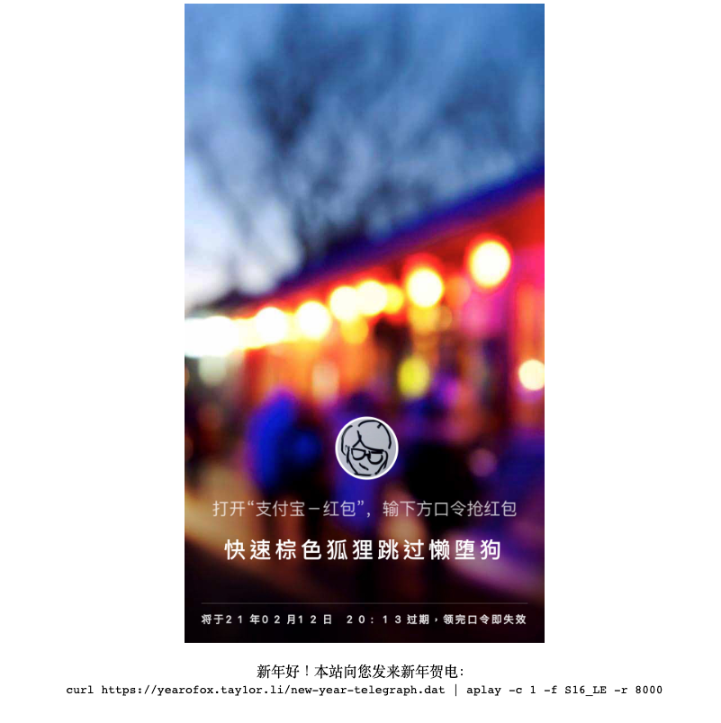

祝贺你！

# 第三个红包

## 电报

第三题最开始的线索是一行 Unix 命令：

```
curl https://yearofox.tay1or.li/new-year-telegraph.dat | aplay -c 1 -f S16_LE -r 8000
```

如果你安装了 alsa 的软件包，并且电脑能够输出声音的话，可以听到一条带有杂音的电报。电报的内容如下：

`4376 1129 1367 2450 2504 1816 2867 9976 6500 7555 0256 1660 9976 8001 0057 1172 1942 9976 1630 4395 5019 3341`

使用汉字电码解码后得到电报的内容是：

> 祝大家新春快乐，身体健康，万事如意，幸福美满

哈哈，标准的新年贺电内容。这里并没有任何玄机。

刚才提到了音频中有杂音。如果你对声学和信号有一些了解的话，可能会注意到这个杂音并不像是噪声（在频域上连续、较为均匀分布），而更像是某种持续的干扰。

即便你没有通过听注意到这一点，也可以把该文件下载下来后在声音处理软件（如 Audacity）中通过观察频谱发现。由于该文件是没有文件头部的裸数据（raw data，我一下想不到汉语中更贴切的叫法），因此导入的时候需要你手动设置参数，而所需的参数已经写在上面的命令里了：

| | |
| -- | -- |
| `-c 1` | 单声道 |
| `-f S16_LE` | 有符号16位，小头字节序 |
| `-r 8000` | 采样率 8000Hz |

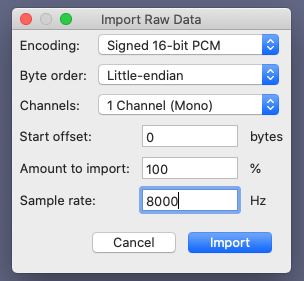

下图为前4秒的频谱，包括开头的空白和“4376”的电码：

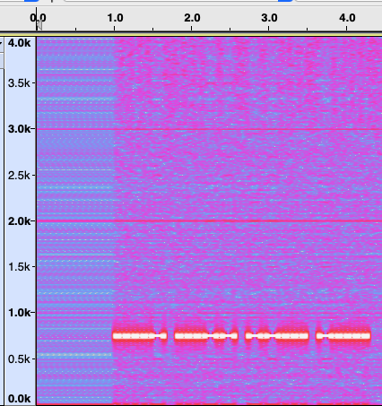

为了探究这个杂音，检查 new-year-telegrah.dat 文件开头部分的二进制表示：

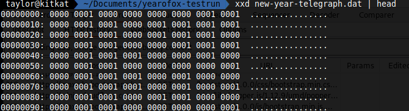

看到开头空白声音的部分，杂音的来源可能是这些零星出现的1。这些1都出现在每个2个字节的位置，即每16个字节中有8个位置。而每8个位置中，第一个位置总是0，这让人联想到 ASCII 码。

频谱上重复的出现的 pattern 说明隐藏的内容可能是不停重复的；而杂音贯穿整个音频文件则说明隐藏的内容也贯穿整个音频。因此我们只需要把整个文件中所有偶数字节的最低位提取出来，每8位拼成一个字节，即可拼凑出隐藏信息。所用的 Python 脚本如下：

```python
f = open('telegraph.dat', 'rb')


res = ''
dat = f.read(16)
while dat:
	b = [i%2 for i in dat[1::2]]
	c = 0
	for i in range(8):
		try:
			c += 2**(7-i) if b[i] else 0
		except:
			break
	res += chr(c)
	dat = f.read(16)

print(res)
```

运行结果如下：

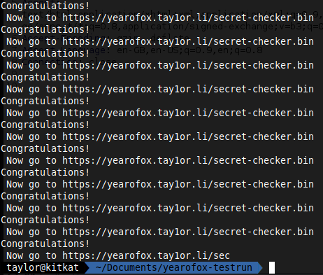

这个结果印证了以上的两点猜测（废话，我自己出的题）。我们得到了又一个 URL。

## elf

下载 secret-checker.bin 文件后，运行 `file secret-check.bin`，发现这是一个 elf 格式的 Linux x86-64 可执行文件。

运行该文件，输出了一个提示“Input key:”。随便输入一些东西后 Enter，提示“Wrong key!”。

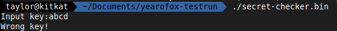

反汇编该文件，看到 main 函数中首先在栈中存了一个数组的数据，每个数据1个字节，总共17个：

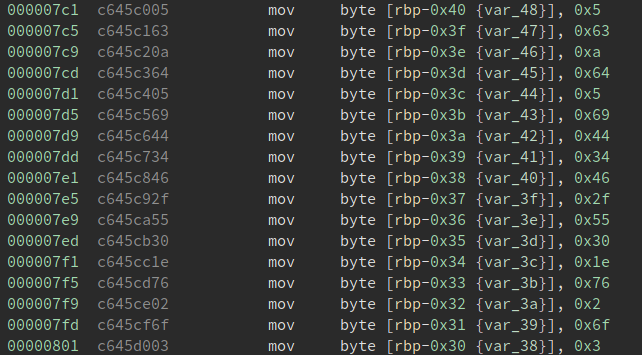

接下来是输出提示，然后 scanf 接受用户输入。从 scanf 的 format string 可以看到期望接受的输入字符数也是17。

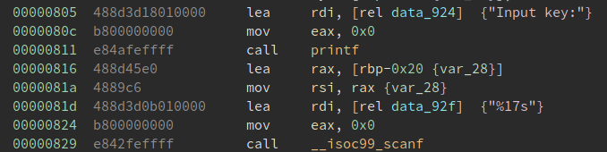

接下来初始化循环中用到的变量，然后在循环中加密用户输入的每一个变量，并且跟数组中对应下标的元素比较：

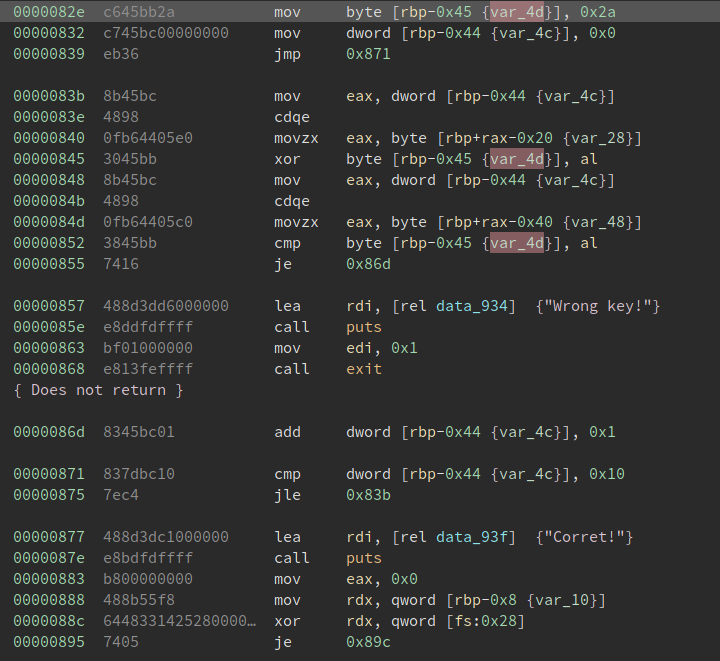

整个程序的 C 源代码如下：

```c
#include <stdio.h>
#include <stdlib.h>

int main()
{
	unsigned char cipher[17] = {5, 99, 10, 100, 5, 105, 68, 52, 70, 47, 85, 48, 30, 118, 2, 111, 3};
	unsigned char input[17];

	printf("Input key:");
	scanf("%17s", input);

	unsigned char k = 42;
	for (int i = 0; i < 17; i++)
	{
		k = input[i] ^ k;
		if (k != cipher[i])
		{
			printf("Wrong key!\n");
			exit(1);
		}
	}

	printf("Corret!\n");
	return 0;

}
```

解题的 Python 脚本如下：

```python
e = [5, 99, 10, 100, 5, 105, 68, 52, 70, 47, 85, 48, 30, 118, 2, 111, 3] # Encrypted data
k = 42 # Initial key
m = [] # Decrypted messages


for i in e:
	m.append(k ^ i)
	k = i

print(''.join([chr(c) for c in m]))
```

输出的结果是：`/final-prize.html`

在浏览器中打开 `https://yearofox.tay1or.li/final-prize.html`, 你就得到了第三个红包的口令：

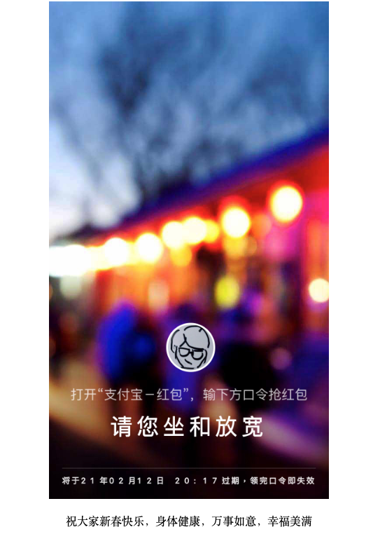

# 彩蛋

其实这部分已经不紧要了。但是因为我做了却没人找到，让我还是想写出来。

查看第三个红包页面的网页源代码，发现注释里写了一些东西。这首“诗”是来自传统相声中的一个笑料。

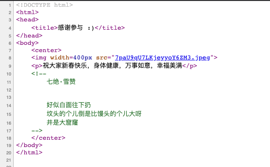

这里缺少了第一句：


# 结语

这次制作 CTF 的过程非常有意思。让大家分享我感到有趣的事，并且还有可能让大家学到一些新的东西，让我很开心。这也是我如此上心、又花这么多时间来写 writeup 的主要原因。（次要原因是看别人解自己出的题本身就很好玩哈哈哈哈）

感谢所有人的参与。希望大家都收获了一些乐趣。至少我自己很开心 :)


